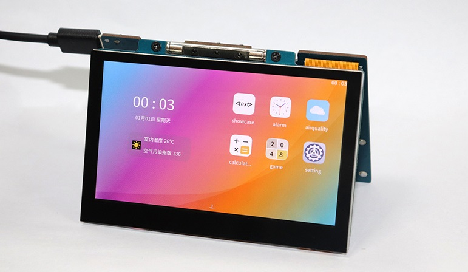

---
# 小熊派-鸿蒙·叔(BearPi-HM Micro)

## 一、BearPi-HM Micro 开发板介绍

BearPi-HM Micro开发板是一块高度集成并可运行Openharmony系统的开发板，板载高性能的工业级处理器STM32MP157芯片，搭配4.3寸LCD电容式触摸屏，并板载wifi电路及标准的E53接口，标准的E53接口可扩展智能加湿器、智能台灯、智能安防、智能烟感等案例。可折叠式屏幕设计大大提高用户开发体验，便于携带和存放，更好地满足不同用户的需求，拓展无限可能。

## 二、应用开发手把手教程系列

1、视频系列（B站） (待上传)

2、文档系列（Gitee）
- [1. 初识BearPi-HM Micro开发板](docs/初识BearPi-HM_Micro开发板.md)
- [2. 开发环境搭建](docs/环境搭建.md)
- [3. 如何烧录系统并启动](docs/如何烧录固件并启动.md)
- [5. 示例应用源码获取](docs/示例应用源码获取.md)
- [6. 编写hello_world hap 应用](docs/hello_word.md)
- [7. 如何安装运行hap应用](docs/如何在开发板上安装HAP应用.md)
- [8. 开发空气质量示例应用](docs/开发空气质量示例.md)
- [9. 开发时钟示例应用](docs/开发时钟案例.md)
- [10. 开发计算器示例应用](docs/开发计算器案例.md)
- [11. 开发图表示例例应用](docs/开发图表示例.md)

## 三、开发板图片预览[（淘宝链接）](https://item.taobao.com/item.htm?id=662078665554)

## 四、联系我们

