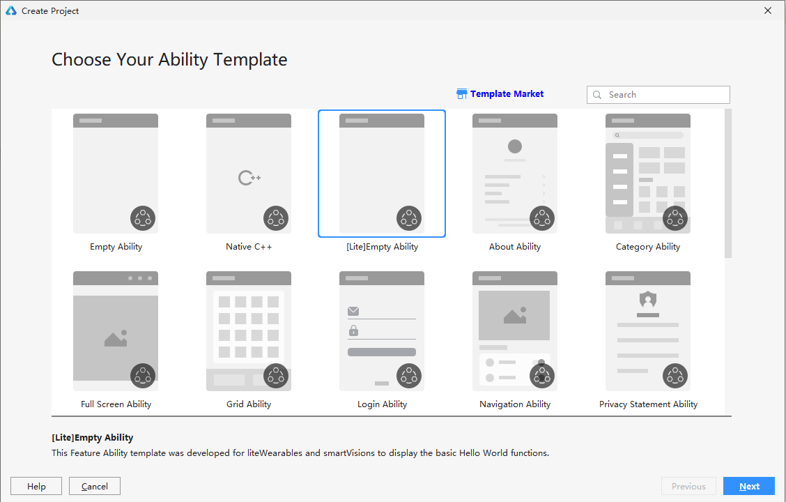
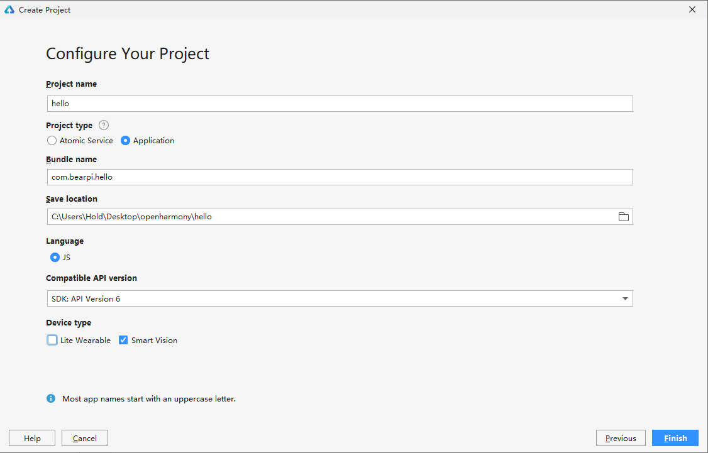
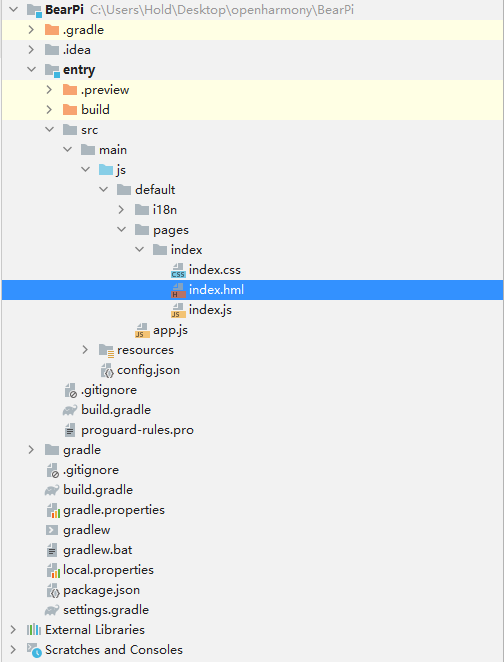
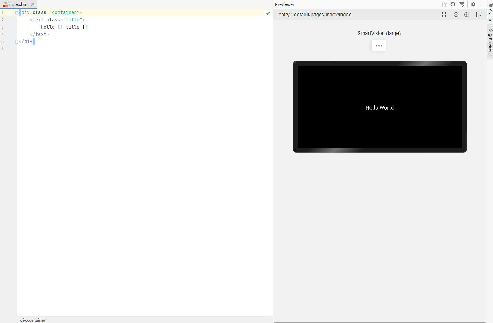
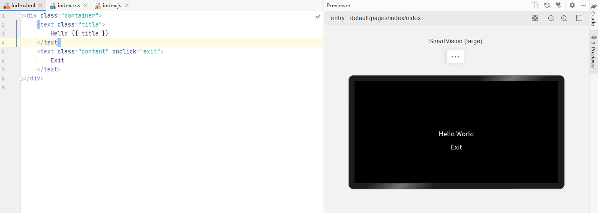
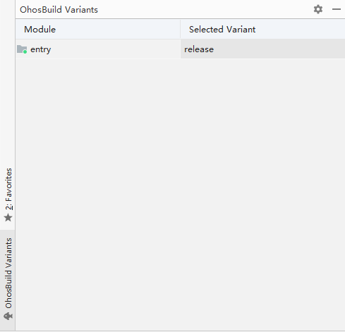
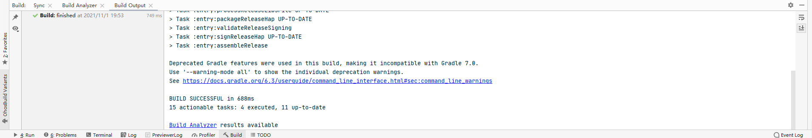
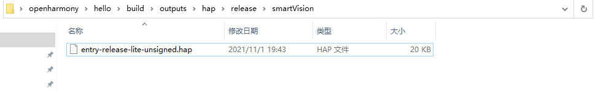

# 一、创建项目
__1.打开DevEco Studio选择[lite]Empty Ability项目__<br>
<br>

__2.点击next，输入项目名称（Project name），项目类型（Project type）选择Application，输入包名（Bundle name），项目存放路径（Save location），开发语言（Language）默认是JS，api支持版本（Compatible API version）这里选择SDK：API Version 6，设备类型（Device type）勾选Smart Vision。__ <br>
<br>
___注：包名格式一般为com.公司名称.项目名称___<br>

__3.点击finish，等待工具自动创建完整的项目工程，这样一个基础的北向应用就创建完成了。__<br>

# 二、编写代码
项目结构示意图<br>
<br>

> __entry->src->main__ 目录为我们项目的主目录<br>
> __main->js__ 为项目代码目录<br>
> __main->resources__ 为项目资源目录<br>

>___注：这里有一点需要注意以下，DevEco Studio在创建项目的时候其实默认还是会选择当前最新的API版本进行创建，如果是使用最新的API版本，你的硬件也需要使用最新的OpenHarmony版本才可以运行程序，如果无法使用最新版本的OpenHarmony，这里请手动更改api版本，方法如下。<br>
找到工程里的两个build.gradle文件，找到其中的compileSdkVersion，将后面对应的数字都改成6即可。___<br>

1.找到index.hml文件，该文件是程序主页面文件，双击它打开编辑视图，开发工具最右侧有一个Previewer按钮，点击可打开预览。<br>
<br>
这就是我们的最简单的一个hello world项目工程了。

2.我们来编写一个退出应用的代码，添加如下界面代码。<br>
```
<div class="container">
    <text class="title">
        Hello {{ title }}
    </text>
    <text class="content" onclick="exit">
        Exit
    </text>
</div>
```
找到index.css文件，该文件是程序主页面对应的css样式文件，双击打开添加如下代码<br>
```
.container {
    width: 100%;
    height: 100%;
    flex-direction: column;
    justify-content: center;
    align-items: center;
}

.title {
    width: 200px;
    font-size: 30px;
    text-align: center;
}

.content{
    margin-top: 20px;
    width: 200px;
    font-size: 30px;
    text-align: center;
}
```
找到index.js文件，该文件是程序主页面对应的JavaScript文件，主要写一些对应的事件代码和逻辑函数。双击打开添加如下代码。<br>
注：注意逗号<br>
```
import app from '@system.app';
export default {
    data: {
        title: 'World'
    },
    exit(e){
        app.terminate()
    }
}
```

完成编辑后的预览<br>


这样我们的一个hello world程序就编写完成了。<br>

# 三、将代码编译成hap包
1.点击编辑器最左下角的OhosBuild Varilants，打开编译模式选择视图，编译模式分debug和release，这里我们选择release模式。<br>
<br>

2.点击编辑器上方菜单栏的Build->Build Hap(s)/App(s)->Build Hap(s)，系统就会开始自动编译代码成hap包，等到下方Build Output无编译错误，就表示代码编译完成了。<br>
<br>

3.完成之后找到项目存放目录进入build->outputs->hap->release->smartVision目录下，这里面就是我们编译好的hap包文件。<br>
<br>