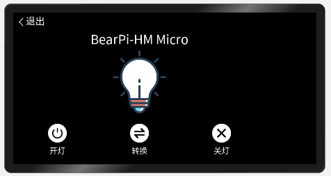

# 一、概述

&nbsp;&nbsp;&nbsp;&nbsp;&nbsp;&nbsp;__通常我们做鸿蒙应用开发的时候是没法调用开发环境中未提供的接口的，本篇我们将介绍如何自定义接口，并于开发板进行交互。__<br>

# 二、相关概念

__JS自定义接口：__ 在我们需要使用一些开发环境未提供给我们的能力时，我们可以自定义一些接口。<br>

__系统定义接口：__  我们定义完JS接口后也是不能直接使用的，必须在系统代码中完成定义的接口才行。

# 三、代码详解

## 1.添加接口定义
&nbsp;&nbsp;&nbsp;&nbsp;&nbsp;&nbsp;首先我们想要调用系统未提供的接口时需要现在系统接口文件中定义一个JS接口，这里我们就在 __@system.app.d.ts__ 文件中定义该接口。该文件在鸿蒙的SDK目录下一般是在 ___SDK目录\js\SDK版本目录\api\smartVision\@system.app.d.ts___ 这个路径下。找到后在其中添加你需要定义的接口，该接口必须是在系统代码中你所实现的接口（需要参考系统接口开发），添加完成后就可以在代码中调用了。<br>

&nbsp;&nbsp;&nbsp;&nbsp;&nbsp;&nbsp;这里以我们的led为例，我们在 __@system.app.d.ts__ 文件中的 `export default class App {}` 类里添加了这样一个接口。<br>
```
export default class App {
  /**
   * Obtains the declared information in the config.json file of an application.
   */
  static getInfo(): AppResponse;

  /**
   * Destroys the current ability.
   */
  static terminate(): void;
  //自定义接口
  static ledcontrol(options: {
	  code: number;
	  success?: (res: string) => void;
	  fail?: (res: string, code: number) => void;
	  complete?: () => void;
  }): void;
}
```
该接口就是请求系统操作LED，__code为指令代码, 0：关闭led，1：打开led，2：led状态翻转，success，fail为该请求的回复，会返回当前led状态，0：关闭状态，1：打开状态。__  这样我们的自定义接口就写好了，接下来就是如何使用它。

## 2.编写页面代码与JS代码
我们在页面添加代码，添加之前先准备好我们需要的图片资源，然后再在index.hml中添加以下代码：<br>
```
<div class="container">
    <div class="title-view">
        <div class="back-view" onclick="exit">
            <image class="back-img" src="../../common/back.png"/>
            <text class="back-btn"> 退出 </text>
        </div>
        <text class="title">
            {{ title }}
        </text>
    </div>
    <image class="ledImg" if="{{statu == '0'}}" src="../../common/led_off.png" />
    <image class="ledImg" if="{{statu == '1'}}" src="../../common/led_on.png" />
    <div class="ledAction">
        <div class="ledAction-view" onclick="open">
            <image class="ledAction-img" src="../../common/open.png"/>
            <text class="ledAction-btn">
                开灯
            </text>
        </div>
        <div class="ledAction-view" onclick="change">
            <image class="ledAction-img" src="../../common/change.png"/>
            <text class="ledAction-btn">
                转换
            </text>
        </div>
        <div class="ledAction-view" onclick="close">
            <image class="ledAction-img" src="../../common/close.png"/>
            <text class="ledAction-btn">
                关灯
            </text>
        </div>
    </div>
</div>
```
然后我们再添加样式代码：<br>
```
.container {
    width: 800px;
    height: 480px;
    flex-direction: column;
    align-items: center;
}

.title {
    width: 800px;
    font-size: 40px;
    text-align: center;
}

.ledImg{
    width: 200px;
    height: 200px;
    margin-top: 10px;
}

.ledAction{
    padding: 10px;
    margin-top: 20px;
    height: 130px;
    width: 800px;
    flex-direction: row;
    justify-content: space-around;
    align-items: center;
}

.ledAction-view{
    width: 120px;
    height: 120px;
    flex-direction: column;
    justify-content: center;
    align-items: center;
}

.ledAction-img{
    width: 60px;
    height: 60px;
}

.ledAction-btn{
    width: 120px;
    margin-top: 10px;
    font-size: 25px;
    text-align: center;
}

.title-view{
    width: 800px;
    height: 110px;
    flex-direction: column;
}

.back-view{
    height: 60px;
    width: 200px;
    flex-direction: row;
    justify-content: flex-start;
    align-items: center;
}
.back-img{
    height: 30px;
    width: 30px;
    margin-left: 10px;
}

.back-btn{
    font-size: 30px;
}
```
接下来我们再来编写JS代码：<br>
```
//灯状态 0是关闭 1是开启
var led = {open:1,close:0,change:2}
import app from '@system.app';
export default {
    data: {
        title: 'BearPi-HM Micro',
        statu:'0'
    },
    exit(e){
        app.terminate()
    },
    open(e){
        let that = this
        app.ledcontrol({
            code:led.open,
            success(res){
                that.statu = res.led_status
            },
            fail(res,code){

            },
            complete(){

            }
        })
    },
    close(e){
        let that = this
        app.ledcontrol({
            code:led.close,
            success(res){
                that.statu = res.led_status
            },
            fail(res,code){

            },
            complete(){

            }
        })
    },
    change(e){
        let that = this
        app.ledcontrol({
            code:led.change,
            success(res){
                that.statu = res.led_status
            },
            fail(res,code){

            },
            complete(){

            }
        })
    }
}
```
我们做了三个点击事件，分别触发 __点亮led，熄灭led，转换led状态__ 返回结果直接表示状态，我们给每种状态绑定一个图片这样就表示灯的开启和熄灭。<br>

页面完成后如下所示：<br>
<br>
点击即可实现控制led<br>

# 四、总结

>__鸿蒙智慧视觉设备当前开发环境提供的系统原生接口相对来说是比较少的，我们想要完成自自定义接口在JS中添加时相对来说比较简单的，关键部分是在系统代码中的实现，需要制作各种各样自定义功能的话需要非常熟悉鸿蒙的这套ace_engine_lite的系统代码。__