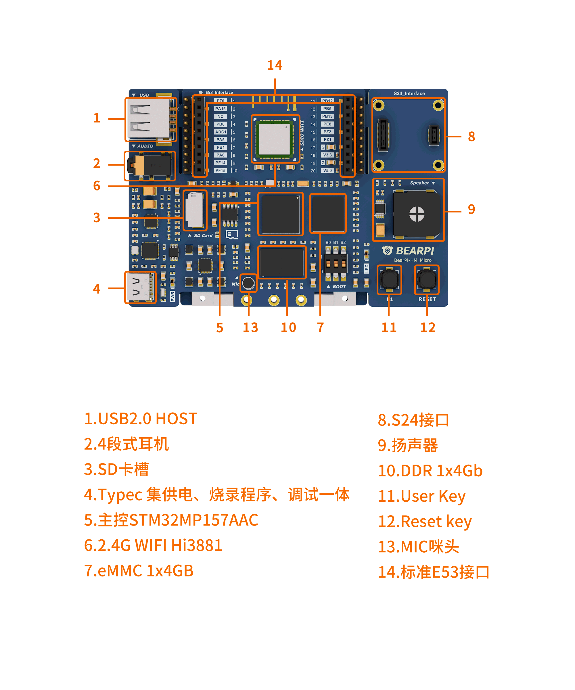

# BearPi-HM Micro开发板介绍

本文档介绍BearPi-HM Micro开发板外观、功能、资源及参数规格，通过学习，开发者会对BearPi-HM Micro开发板有初步认识，并可上手业务开发。

## 开发板简介

BearPi-HM Micro开发板是一块高度集成并可运行Openharmony系统的开发板，板载高性能的工业级处理器STM32MP157芯片，搭配4.3寸LCD电容式触摸屏，并板载wifi电路及标准的E53接口，标准的E53接口可扩展智能加湿器、智能台灯、智能安防、智能烟感等案例。可折叠式屏幕设计大大提高用户开发体验，便于携带和存放，更好地满足不同用户的需求，拓展无限可能。

### 购买地址 [点击购买](https://item.taobao.com/item.htm?id=662078665554)

### 视频教程地址 （待上传）

## 开发板硬件资源

**表 1**  BearPi-HM Micro开发板硬件规格清单

| No | 功能 | 参数  |
| ---- | ---- |  ------------------------------------------------------------ |
| 1    | Power |  5V Typec供电|
| 2    | eMMC |  1x4GB|
| 3    | DDR |  1x4Gb|
| 4    | LCD | 4.3寸电容式触摸屏|
| 5    |WIFI | Hi3881 支持WIFI 2.4G|
| 6    | KEY| Reset key x1, User Key x1 |
| 7    | Typec | 集供电、烧录程序、调试一体|
| 8    | LED | LED x1|
| 9    | USB HOST | 一路 USB2.0 HOST|
| 10    |AUDIO |4段式耳机 x1，MIC咪头 x1，扬声器 x1|
| 11    |Expansion | 支持 标准E53接口 x1, S24接口 x1|

## 开发板软件资源

* 搭载Openharmony 3.0 操作系统
* 轻量级ACE UI框架，支持JS应用开发部署
* 支持分布式软总线，用户应用程序可分可合、可跨设备流转（TODO）

**表 2**  BearPi-HM Micro开发板平台驱动支持清单

| No | 类别 &nbsp; | 是否支持 &nbsp;&nbsp;&nbsp;&nbsp;&nbsp;&nbsp;&nbsp;&nbsp;&nbsp;&nbsp;&nbsp;&nbsp;&nbsp;&nbsp;&nbsp;&nbsp;&nbsp;&nbsp;&nbsp;&nbsp;&nbsp;&nbsp;&nbsp;&nbsp;&nbsp;&nbsp;&nbsp;&nbsp;&nbsp;&nbsp;&nbsp;&nbsp;&nbsp;&nbsp;&nbsp;&nbsp;&nbsp;&nbsp;&nbsp;&nbsp;&nbsp;&nbsp;&nbsp;|
| ---- | ---- | ------------- |
| 1    | GPIO | 支持|
| 2    | I2C | 支持|
| 3    |RTC | TODO|
| 4    | SDIO | 支持|
| 5    | SPI | TODO|
| 6    | UART | 支持|
| 7    | WATCHDOG | 支持|
| 9    |MMC | 支持|
| 10   |PWM | TODO|
| 11   |ADC | TODO|
| 12   |I2S | TODO|

**表 3**  BearPi-HM Micro开发板外设驱动支持清单

| No | 类别 &nbsp;&nbsp;&nbsp;&nbsp;&nbsp;&nbsp;&nbsp;&nbsp;&nbsp;&nbsp;&nbsp; | 是否支持 &nbsp;&nbsp;&nbsp;&nbsp;&nbsp;&nbsp;&nbsp;&nbsp;&nbsp;&nbsp;&nbsp;&nbsp;&nbsp;&nbsp;&nbsp;&nbsp;&nbsp;&nbsp;&nbsp;&nbsp;&nbsp;&nbsp;&nbsp;&nbsp;&nbsp;&nbsp;&nbsp;&nbsp;&nbsp;&nbsp;&nbsp;&nbsp;&nbsp;&nbsp;&nbsp;&nbsp;&nbsp;&nbsp;&nbsp;&nbsp;&nbsp;&nbsp;&nbsp;|
| ---- | ---- |  ------ |
| 1    | LCD | 支持|
| 2    | TOUCH | 支持|
| 3    | AUDIO | TODO|
| 4    | NETWORK | TODO|
| 5    | SENNOR | TODO|
| 6    | USB | TODO|

