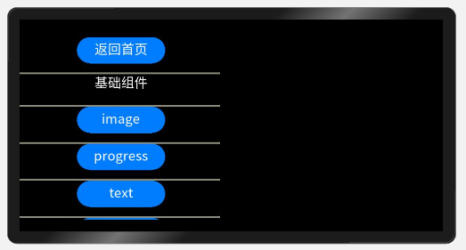

# 一、概述
__本篇我们将介绍L1开发板的Showcase案例，这是一个由鸿蒙JS开发模式所开发的北向应用案例。该案例向我们介绍了鸿蒙JS开发模式下的一些界面布局元素，包括容器、组件、事件、动画等界面元素。__

# 二、相关概念
__鸿蒙JS开发模式：__ 基于JS扩展的类Web开发范式支持纯JavaScript、JavaScript和Java混合语言开发。<br>

__JS FA：__ 指基于JavaScript或JavaScript和Java混合开发的FA<br>
__JS FA开发目录：__ （以下为我们的showcase工程）<br>
<br>
在该工程目录中：<br>
__common__ 下存放工程中使用的公共文件，可以是image文件，js文件或一些自定义的公共组件。<br>
pages文件夹下存放多个页面，每个页面由hml、css和js文件组成。<br>
__js > default > pages > index > index.hml：__ 此文件定义了index页面的布局、index页面中用到的组件，以及这些组件的层级关系。其使用的是类html语言开发，有一些特性与vue类似。<br>
__js > default > pages > index > index.css：__ 此文件定义了index页面的样式。其使用的css样式代码，与一般web开发所使用的css基本一致。<br>
__js > default > pages > index > index.js：__ 此文件定义了index页面的业务逻辑，比如数据绑定、事件处理等。其实用的是JavaScript语言开发，类似于vue或微信小程序开发模式。<br>

# 三、代码讲解
## 1.首页

<br>
该图是项目运行时的首页预览效果图，这是一个可滚动的list，其中每行所包含的button按钮对应展示一类组件。底部button按钮是退出程序按钮。<br>
### list使用示例
```
<list>

  <list-item>
    <button>自定义按钮</button>
  </list-item>

  <list-item>
    <text>自定义文本<text/>
  </list-item>

  <list-item>
    ...其他内容（可以是任意组）
  </list-item>

</list>
```
## 2.容器组件
点击容器组件进入<br>
<br>
我们可以看到同样是通过一个滚动的list展示容器组中一些常用的组件。其中包括div、list、stack、swiper，点击可进入每个容器组件的详细展示。<br>
组件简介：<br>
__div：__ 基础容器，用作页面结构的根节点或将内容进行分组。<br>
__list：__ 列表包含一系列相同宽度的列表项。适合连续、多行呈现同类数据，例如图片和文本。<br>
__stack：__ 堆叠容器，子组件按照顺序依次入栈，后一个子组件覆盖前一个子组件。<br>
__swiper：__ 滑动容器，提供切换子组件显示的能力。<br>
这里我们选择div来进行详细解析，点击div进入div页面。<br>

<br>
这里有属性、通用样式、特殊样式、事件这四种属性的演示。我们先来进入属性页面。
<br>

## 属性
属性：属性总是以名称/值对的形式出现，比如：`name="value"`。<br>
属性可以决定元素拥有什么样的内容，事件，样式，显示方式等多种信息。<br>

<br>
这里展示的是一些通用属性，这些属性可以运用于几乎所有组件。其中包括if、show、for等通用属性这里我们先来进入if看一下。<br>

## if

<br>
进入之后点击if按钮可以改变div的if属性。<br>
__if：__ 决定组件是否存在，通过设置if属性我们可以决定该组件是否需要放置于布局中。<br>
注：不显示外观且不会占据布局的空间<br>

核心代码：
```
hml代码：

  <div
    if="{{ status }}"
    style="width: 280px; height: 110px; margin-top: 10px; margin-left:85px; background-color: #00ff00">
    <text class="text"> 观察if属性作用 </text>
  </div>

  <input
    type="button"
    style="width: 140px; height: 60px; margin-left: 150px; margin-top: 10px"
    value="if"
    onclick="changeStatus"
  />

js代码：

  data: {
    text1: "点击按钮改变状态",
    status: true
  },
  changeStatus: function() {
    if (this.status == true) {
      this.status = false;
    } else {
      this.status = true;
    }
  }
```
hml部分代码讲解：<br>
首先是定义了一个div容器组件，给div设置if属性，这里给if属性绑定了一个动态的变量`{{ status }}`该变量在js代码中的data模块下定义，status的值为布尔值。然后在div下方定义了一个input组件，这里的input设置的type属性为button所以可以视为是一个button，这里给这个button的onclick绑定了一个`changeStatus`函数，该函数在js代码中定义。<br>

js部分代码讲解：<br>
首先是`data`数据模块，里面有刚刚为div的if属性定义的一个bool变量`status`，该模块通常定义一些数据变量提供给hml页面使用。代码块之间通过逗号分隔。data下方定义的是一个`changeStatus`函数，该函数通过判断`status`的当前值来改变`status`的值，这样界面上点击按钮之后就会改变div所绑定的if属性的值。

## show
接着进入show看一下


<br>
进入之后点击show按钮可以改变div的show属性。<br>
__show：__ 决定组件是否显示，通过设置show属性我们可以决定该组件是否需要显示外观。<br>
注：不显示外观但仍然会占据布局的空间<br>

核心代码：
```
hml代码：

  <div
    id="{{ div01 }}"
    show="{{ status }}"
    style="width: 280px; height: 110px; margin-top: 10px; margin-left: 85px; background-color: #00ff00"
  >
    <text class="text"> 观察show属性作用 </text>
  </div>

  <input
    type="button"
    style="width: 140px; height: 80px; margin-left: 150px; margin-top: 10px"
    value="show, id={{ div01 }}"
    onclick="changeStatus"
  />

js代码：

  data: {
    text1: "点击按钮改变状态",
    status: true,
    div01: "div01"
  },
  changeStatus: function() {
    if (this.status == true) {
      this.status = false;
    } else {
      this.status = true;
    }
  }

```
hml部分代码讲解：<br>
同样的先是定义一个div，给div设置show属性，这里给show属性绑定了一个动态的变量`{{ status }}`该变量在js代码中的data模块下定义，status的值为布尔值。然后在div下方定义了一个input组件，这里的input设置的type属性为button所以可以视为是一个button，这里给这个button的onclick绑定了一个`changeStatus`函数，该函数在js代码中定义。<br>

js部分代码讲解：<br>
首先是`data`数据模块，里面有刚刚为div的show属性定义的一个bool变量`status`，该模块通常定义一些数据变量提供给hml页面使用。代码块之间通过逗号分隔。data下方定义的是一个`changeStatus`函数，该函数通过判断`status`的当前值来改变`status`的值，这样界面上点击按钮之后就会改变div所绑定的show属性的值。

## for
接着进入for看一下

<br>
进入之后已经显示了for属性的特性，界面上有三个排列在一起的div。<br>
__for：__ 决定组件自动生成的数量，通过设置for属性我们可以决定该组件在布局中存在的数量。<br>
注：相当于对该组件代码复制多份

核心代码：
```
hml代码：

  <div
    for="{{ loopArray }}"
    style="width:280px;height:50px;margin-top:10px;margin-left:85px;background-color:#00ff00;display:{{ display }}"
  >
    <text class="text"> loop </text>
    <image src="common/leftHead.png" class="image"></image>
  </div>

js代码：

    data: {
    text1: "点击按钮改变状态",
    loopArray: ["1", "2", "3"],
    display: "flex"
  },
```
hml部分代码讲解：<br>
同样的先是定义一个div，给div设置for属性，这里给for属性绑定了一个动态的变量`{{ loopArray }}`该变量在js代码中的data模块下定义，loopArray的值为数组。剩下再给div填充一些内容，设置一些样式。这样for属性就会根据给定的数组中元素数量生成同样数量的div。<br>

js部分代码讲解：<br>
首先是`data`数据模块，里面有刚刚为div的for属性定义的一个数组变量`loopArray`，该模块通常定义一些数据变量提供给hml页面使用。代码块之间通过逗号分隔。通过给`loopArray`赋予初始数组，for属性就会根据数组中元素数量生成同数量的div。

## 样式
接下来我们点击返回上级，这里有通用样式和特有样式，通用样式与特有样式都是样式。<br>
样式：style属性用于改变元素的样式，比如：`style="width=80px;"`通过样式可以设置元素的大小、位置、颜色、形状等，是决定元素外观的重要属性。样式也可以通过class属性来绑定css文件中的样式语句来实现。<br>
通用样式表示所几乎所有组件都可适用的一些样式，如宽、高、颜色等。特有样式是一些组件所特有的样式属性。<br>
示例：hml
```
<text style="width: 240px; height: 160px;">
  标题
</text>
<text class="title">标题</text>
```
示例：css
```
.title{
    width: 80px;
    height: 40px;
    font-size: 30px;
    color: black;
}
```
<br>
<br>
样式部分可结合项目代码与项目展示的效果来进行对比学习。通常使用class绑定css的形式进行开发。<br>
这里简单介绍一下div的部分特有样式。<br>
<br>
```
  <div
    style="
      width: 280px;  /* 宽度 */
      height: 180px; /* 高度 */
      margin-top: 20px; /* 上方外边距 */
      margin-left: 85px; /* 左边外边距 */
      background-color: #00ff00; /* 背景色 */
      justify-content: flex-end; /* 设置或检索弹性盒子元素在主轴（横轴）方向上的对齐方式：从行尾位置开始排列 */
      align-items: center; /* 子项在flex容器的当前行的侧轴（纵轴）方向上的对齐方式 */
    "
  >
    <div style="width: 50px; height: 50px; background-color: #ff0000"></div>
    <div style="width: 50px; height: 50px; background-color: #0000ff"></div>
    <div style="width: 50px; height: 50px; background-color: #ff0000"></div>
  </div>
```
<br>
```
  <div
    style="
      width: 280px;
      height: 180px;
      margin-top: 20px;
      margin-left: 85px;
      background-color: #00ff00;
      flex-direction: column; /* 属性规定灵活项目的方向 ：灵活的项目将垂直显示，正如一个列一样*/
      justify-content: space-between;/* 均匀排列每个元素首个元素放置于起点，末尾元素放置于终点 */
    "
  >
    <div style="width: 50px; height: 50px; background-color: #ff0000"></div>
    <div style="width: 50px; height: 50px; background-color: #0000ff"></div>
    <div style="width: 50px; height: 50px; background-color: #ff0000"></div>
  </div>
```
<br>
```
  <div
    style="
      width: 280px;
      height: 180px;
      margin-top: 20px;
      margin-left: 85px;
      background-color: #00ff00;
      flex-wrap: wrap; /* 规定灵活的项目在必要的时候拆行或拆列 */
      justify-content: center; /* 居中排列 */
    "
  >
    <div style="width: 50px; height: 50px; background-color: #ff0000"></div>
    <div style="width: 50px; height: 50px; background-color: #0000ff"></div>
    <div style="width: 50px; height: 50px; background-color: #ff0000"></div>
    <div style="width: 50px; height: 50px; background-color: #0000ff"></div>
    <div style="width: 50px; height: 50px; background-color: #ff0000"></div>
    <div style="width: 50px; height: 50px; background-color: #0088ff"></div>
    <div style="width: 50px; height: 50px; background-color: #ff8800"></div>
  </div>
```

## 事件
接下来我们点击返回上级，进入事件来学习一下。<br>
事件：当用户点击某个元素时启动一段JavaScript，即触发某段js文件中所定义的函数。<br>
通常我们为元素定义一个点击事件，`onclick="ok"`onclick为该元素的点击事件，ok为js中定义的函数。<br>
根据组件的不同，事件也分通用事件与特有事件，他们都统称为事件。<br>
示例：hml
```
<text onclick="ok">确认</text>
```
示例：js
```
ok(e){
    console.log('ok')
    ...自定义处理
}
```
<br>
这里所展示的是三个通用事件，基本所有组件都有这三种事件属性，它们分别是click、longpress、swipe。<br>
click：单击，组件被单击之后触发<br>
longpress：长按，长按组件后触发<br>
swipe：滑动，焦点在组件上划过之后触发<br>

<br>
核心代码：
```
hml代码：

  <div
    style="width: 280px; height: 120px; margin-top: 10px; margin-left: 85px; background-color: #00ff00"
    onclick="clickFunc"
    onlongpress="longpressFunc"
    onswipe="swipeFunc"
  >
    <text class="text"> 操作div触发事件 </text>
  </div>
  <text class="text" style="margin-left: 105px">
    {{ text1 }}
  </text>
  <text class="text" style="margin-left: 105px">
    {{ text2 }}
  </text>
  <text class="text" style="margin-left: 105px">
    {{ text3 }}
  </text>

js代码：

  export const eventCommon = function() {
    return {
      text1: "点击事件未触发",
      text2: "长按事件未触发",
      text3: "swipe事件未触发",
      clickFunc: function() {
        this.text1 = "点击事件已触发";
      },
      longpressFunc: function() {
        this.text2 = "长按事件已触发";
      },
      swipeFunc: function(e) {
        this.text3 = "swipe方向：" + e.direction;
      }
    };
  };

  import { backPage, eventCommon } from "../../../../common/js/general";
  export default {
    ...backPage("pages/component/div/indexEvent/index"),
    data: {
      text1: eventCommon().text1,
      text2: eventCommon().text2,
      text3: eventCommon().text3
    },
    clickFunc: eventCommon().clickFunc,
    longpressFunc: eventCommon().longpressFunc,
    swipeFunc: eventCommon().swipeFunc
  };
```
hml部分代码讲解：<br>
该案例首先创建了一个div组件，然后给该div组件的`onclick`、`onlongpress`、`onswipe`三个事件绑定了三个函数，当用户对该组件进行点击，长按，滑动操作时，就会分别触发事件绑定的这三个函数。下方的三个text绑定了三组字符，通过事件触发函数改变绑定的字符，用来验证用户是否已触发事件。<br>

js部分代码讲解：<br>
该案例js部分则是实现了这三个函数的具体内容，通过外部函数导入的方式，在函数触发时改变text文本所绑定的变量。

## 3.基础组件
返回首页，点击基础组件进入<br>
<br>
基础组件是一些常用的控制，显示组件。<br>
组件简介：<br>
image：图片组件，用来渲染展示图片。<br>
progress：进度条，用于显示内容加载或操作处理进度。<br>
text：文本，用于呈现一段信息。<br>
marquee：跑马灯组件，用于展示一段单行滚动的文字。<br>
chart：图表组件，用于呈现线形图、柱状图、量规图界面。<br>
canvas：提供画布组件。用于自定义绘制图形。<br>
这里我们简单介绍下image、progress、chart这三种组件。

## image
与大部分组件一样，拥有属性、样式与事件，并且支持所有通用属性、样式、事件。<br>
<br>
除支持通用属性外，还支持如下属性：<br>
src：图片的路径，支持本地和云端路径，图片格式包括png、jpg、bmp、svg和gif。<br>
src是图片组件的重要特有属性，表示图片的引用的来源，如果引用云端图片的话需要申请权限ohos.permission.INTERNET。<br>
示例：
```
  <image src="{{...图片路径地址}}" >
  </image>
```

## progress
进度条组件，一般分为环形进度条和水平进度条，同样拥有组件通用属性。<br>
<br>
<br>
组件一些特有属性：<br>
type：设置进度条的类型，horizontal：线性进度条；ring：圆环形进度条；eclipse5+：圆形进度条，展现类似月圆月缺的进度展示效果，等一些可选值。<br>
percent：当前进度，取值范围为0-100。<br>
示例：
```
<div class="container">
  <progress type="scale-ring"  percent= "10"></progress>
  <progress type="horizontal" percent= "10" secondarypercent="50"></progress>
</div>
```

## chart
图表组件，通常包括线型图，柱状图等统计图表。<br>

<br>
组件一些特有属性：
type：设置图表类型（不支持动态修改），可选项有：bar：柱状图、line：线形图等等。<br>
options：图表参数设置，柱状图和线形图必须设置参数设置，量规图不生效。可以设置x轴、y轴的最小值、最大值、刻度数、是否显示，线条宽度、是否平滑等。（不支持动态修改）<br>
datasets：数据集合，柱状图和线形图必须设置数据集合，量规图不生效。可以设置多条数据集及其背景色。<br>
除此之外，chart还包含很多特有属性，由于太过繁多且复杂这里通过几段代码简单帮助大家认识chart。<br>
公用引用代码：<br>
```
js代码

  export const dataCommon = {
    datasets: {
      barsets: [
        {
          fillColor: "#9c9c9c",
          data: [2478, 2600, 3000, 3200, 3500, 3888, 4023, 4501, 4999, 5267]
        },
        {
          fillColor: "#3f9c3f",
          data: [2000, 2, 800, 700, 433]
        },
        {
          fillColor: "#9c3f3f",
          data: [100, 200, 300, 400, 500, 600, 550, 450, 350]
        }
      ],
      linesets: [
        {
          strokeColor: "#eeaaff",
          data: [2478, 2600, 3000, 3200, 3500, 3888, 4023, 4501, 4999, 5267]
        },
        {
          strokeColor: "#ccddee",
          data: [2000, 2, 800, 700, 433]
        },
        {
          strokeColor: "#ddaacc",
          data: [100, 200, 300, 400, 500, 600, 550, 450, 350]
        }
      ]
    },
    options: {
      xAxis: {
        min: 0,
        max: 10,
        axisTick: 5,
        display: false
      },
      yAxis: {
        min: 0,
        max: 5000,
        axisTick: 5,
        display: false
      }
    },
    optionsNoDisplay: {
      xAxis: {
        min: 0,
        max: 10,
        axisTick: 5
      },
      yAxis: {
        min: 0,
        max: 5000,
        axisTick: 5
      }
    }
  };

  export const changeStatus = function() {
    if (this.status == true) {
      this.status = false;
    } else {
      this.status = true;
    }
  };
```
线性图示例：<br>
```
hml代码：

  <div style="width: 454px; height: 454px; left: 0px; top: 0px; flex-direction: column">
    <chart
      type="line"
      id="{{ chart01 }}"
      show="{{ status }}"
      datasets="{{ datasets }}"
      options="{{ options }}"
      style="type: line; width: 280px; height: 120px; margin-top: 10px; margin-left: 85px"
      onclick="clickFunc"
      onlongpress="longpressFunc"
    >
    </chart>
    <input
      type="button"
      class="text"
      style="margin-left: 105px; width: 230px"
      value="id={{ chart01 }}"
      onclick="changeStatus"
    />
    <text class="text" style="margin-left: 105px; width: 280px">
      {{ text1 }}
    </text>
  </div>

js代码：

  import { backPage, routePage } from "../../../../../common/js/general";
  import { dataCommon, changeStatus } from "../../../../../common/js/chart";
  export default {
    ...backPage("pages/component/chart/lineChart/indexAttr/index"),
    data: {
      datasets: dataCommon.datasets.linesets,
      options: dataCommon.options,
      chart01: "chart01",
      status: true,
      text1: "显示状态改变"
    },
    changeStatus: changeStatus
  };
```
柱状图示例：<br>
```
hml代码：

  <div style="width: 454px; height: 454px; left: 0px; top: 0px; flex-direction: column">
    <stack style="width: 454px; height: 80px; margin-top: 80px">
      <input type="button" style="left: 85px; width: 130px; height: 60px" value="首页" onclick="backMain" />
      <input type="button" style="left: 235px; width: 130px; height: 60px" value="上一页" onclick="backSuperior" />
    </stack>
    <chart
      type="bar"
      id="{{ chart01 }}"
      show="{{ status }}"
      datasets="{{ datasets }}"
      options="{{ options }}"
      style="type: bar; width: 280px; height: 120px; margin-top: 10px; margin-left: 85px"
      onclick="clickFunc"
      onlongpress="longpressFunc"
    >
    </chart>
    <input
      type="button"
      class="text"
      style="margin-left: 105px; width: 230px"
      value="id={{ chart01 }}"
      onclick="changeStatus"
    />
    <text class="text" style="margin-left: 105px; width: 280px">
      {{ text1 }}
    </text>
  </div>

js代码：

  import { backPage, routePage } from "../../../../../common/js/general";
  import { dataCommon, changeStatus } from "../../../../../common/js/chart";
  export default {
    ...backPage("pages/component/chart/barChart/indexAttr/index"),
    data: {
      text1: "显示状态改变",
      chart01: "chart01",
      status: true,
      datasets: dataCommon.datasets.barsets,
      options: dataCommon.options
    },
    changeStatus: changeStatus
  };

```

## 4.表单组件
返回首页，点击表单组件进入。<br>
<br>
表单组件通常指制作form表单时常用的一些组件，这里仅提供input、slider、switch、picker-view四个组件的示例。与大部分基础组件相同，都继承大部分通用属性与事件。<br>
input：交互式组件，包括单选框，多选框，按钮和单行文本输入框。<br>
slider：滑动条组件，用来快速调节设置值，如音量、亮度等。<br>
switch：开关选择器，通过开关，开启或关闭某个功能。<br>
picker-view：嵌入页面的滑动选择器。<br>
这里简单介绍下input，其他组件内容请参考完整示例学习。<br>

## input
点击imput进入<br>
<br>
>input组件特有属性：<br>
__type：__ input组件类型，可选值为text，email，date，time，number，password，button，checkbox，radio。其中text，email，date，time，number，password这六种类型之间支持动态切换修改。button，checkbox，radio不支持动态修改。<br>

>可选值定义如下：<br>
__button：__ 定义可点击的按钮；<br>
__checkbox：__ 定义多选框；<br>
__radio：__ 定义单选按钮，允许在多个拥有相同name值的选项中选中其中一个；<br>
__text：__ 定义一个单行的文本字段<br>
__email：__ 定义用于e-mail地址的字段；<br>
__date：__ 定义 date 控件（包括年、月、日，不包括时间）；<br>
__time：__ 定义用于输入时间的控件（不带时区）；<br>
__number：__ 定义用于输入数字的字段；<br>
__password：__ 定义密码字段（字段中的字符会被遮蔽）。<br>

button示例：<br>
<br>
```
<input type="button" show="{{ status }}" class="button" value="show" />
```


checkbox示例：<br>
<br>
```
<input type="checkbox" show="{{ status }}" class="checkbox" />
```

radio示例：<br>
<br>
```
<input type="radio" show="{{ status }}" class="checkbox" />
```

## 5.动画
返回首页，点击其他>animation进入。<br>
<br>
动画与组件不同，他是组件的一种动态样式，即动画本身就是一种样式，它是通过复杂的css样式设计完成的具有动态效果的样式。<br>
这里简单的介绍2个示例：<br>

1.延迟改变颜色<br>
<br>

```
hml代码：

  <stack class="stack">
    <stack style="width: 454px; height: 60px; top: 60px">
      <input type="button" style="left: 85px; width: 130px; height: 50px" value="首页" onclick="backMain" />
      <input type="button" style="left: 235px; width: 130px; height: 50px" value="上一页" onclick="backSuperior" />
    </stack>
    <div class="divBlock divAnimationStyle" style="animation-name: animationChange1; top: 120px">
      <text style="width: 200px; height: 80px; font-size: 30px"> delay:3000ms </text>
    </div>
  </stack>

css代码：
  .stack {
    left: 0px;
    top: 0px;
    width: 454px;
    height: 454px;
  }

  .divBlock {
    width: 200px;
    height: 80px;
    left: 120px;
    background-color: #ff0000;
  }

  .divAnimationStyle {
    animation-duration: 3000ms;
    animation-timing-function: linear;
    animation-fill-mode: none;
    animation-delay: 3000ms;
    animation-iteration-count: 1;
  }

  @keyframes animationChange1 {
    from {
      background-color: #ff0000;
    }
    to {
      background-color: #0000ff;
    }
  }
```

代码详解：<br>
这里是通过给div绑定一个class样式`class="divBlock divAnimationStyle"`，其中divBlock是一些基础样式设置，divAnimationStyle是动画样式设置，这里设置了一些动画的基本参数，比如animation-duration：动画持续时间，animation-delay：动画延迟时间。然后通过style绑定一个animation效果`animation-name: animationChange1;`，使其绑定css文件中定义的animationChange1动画效果。其中的`from{},to{}`表示了从一个颜色转变到另一个颜色。css中通过@keyframes关键字定义动画效果。<br>

__@keyframes：__ 通过 @keyframes 规则，您能够创建动画。创建动画的原理是，将一套 CSS 样式逐渐变化为另一套样式。在动画过程中，您能够多次改变这套 CSS 样式。以百分比来规定改变发生的时间，或者通过关键词 "from" 和 "to"，等价于 0% 和100%。0% 是动画的开始时间，100% 动画的结束时间。为了获得最佳的浏览器支持，您应该始终定义 0% 和 100% 选择器。<br>


2.组件移动<br>
<br>

```
hml代码：

  <stack class="stack">
    <stack style="width: 454px; height: 60px; top: 60px">
      <input type="button" style="left: 85px; width: 130px; height: 50px" value="首页" onclick="backMain" />
      <input type="button" style="left: 235px; width: 130px; height: 50px" value="上一页" onclick="backSuperior" />
    </stack>
    <div class="divBlock divAnimationStyle" style="animation-name: animationChange1; top: 120px">
      <text style="width: 200px; height: 60px; font-size: 30px"> translateX </text>
    </div>
    <div class="divBlock divAnimationStyle" style="animation-name: animationChange2; top: 180px">
      <text style="width: 200px; height: 60px; font-size: 30px"> translateY </text>
    </div>
    <image
      src="common/leftHead.png"
      style="
        height: 100px;
        width: 100px;
        left: 200px;
        top: 240px;
        animation-duration: 3000ms;
        animation-timing-function: linear;
        animation-fill-mode: none;
        animation-iteration-count: 1;
        animation-name: animationChange3;
      "
    >
    </image>
  </stack>

css代码：

  .stack {
    left: 0px;
    top: 0px;
    width: 454px;
    height: 454px;
  }

  .divBlock {
    width: 200px;
    height: 60px;
    left: 120px;
    background-color: #ff0000;
  }

  .divAnimationStyle {
    animation-duration: 3000ms;
    animation-timing-function: linear;
    animation-fill-mode: none;
    animation-iteration-count: 1;
  }

  @keyframes animationChange1 {
    from {
      transform: translateX(120px);
    }
    to {
      transform: translateX(170px);
    }
  }

  @keyframes animationChange2 {
    from {
      transform: translateY(180px);
    }
    to {
      transform: translateY(230px);
    }
  }

  @keyframes animationChange3 {
    from {
      transform: rotate(0deg);
    }
    to {
      transform: rotate(360deg);
    }
  }
```

代码详解：<br>
同样是通过class或style的方式给控件分别定义好基本样式以及动画样式，上面2个div分别是绑定了animationChange1和animationChange2，这两个是平移动画效果，下面的image则是绑定了animationChange3，旋转动画效果。同时这三个组件都共同绑定了divAnimationStyle，动画的参数设置，由于设置的是同样的动画持续时间，所以这三个组件的动画效果都是同时结束的。

# 四、总结
>鸿蒙JS开发模式与web开发相近，对有web开发经验或小程序开发经验的开发者较为友好，html与js本身易读性也较强，也比较适合经验尚浅的新人开发者学习，且JS开发模式可以使程序更加轻量化也更加适合鸿蒙智能产品的开发。<br>
该案例基本涵盖了部分常用的JS模式开发组件的常见用法，内容丰富且较为详细，适合新人开发者多钻研学习。


# 五、完整示例


