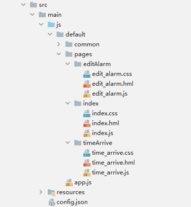
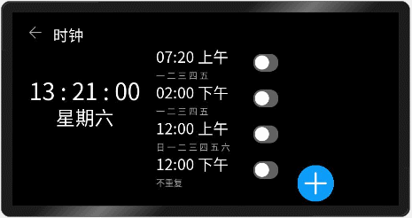
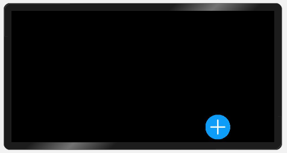
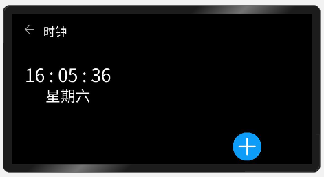
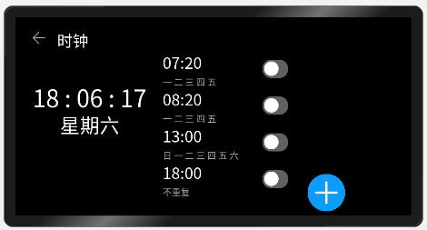
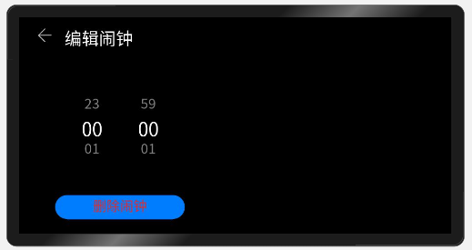
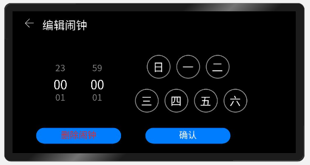
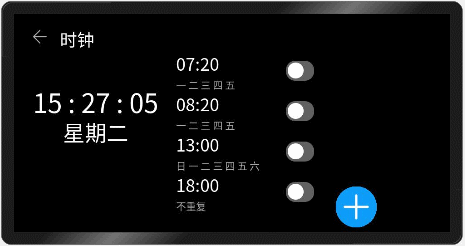

# 一、概述
__本篇我们将介绍L1开发板的Alarm案例，这是一个由鸿蒙JS开发模式所开发的北向应用案例。通过学习开发该案例，我们将会更进一步学习css布局的细节。__<br>

# 二、相关概念
__flex：__ 弹性盒子布局。<br>

__flex-direction：__ 设置容器内元素排列的方式与方向。<br>

__justify-content：__ 用于设置或检索弹性盒子元素在主轴（横轴）方向上的对齐方式。<br>

__align-items：__ 属性定义flex子项在flex容器的当前行的侧轴（纵轴）方向上的对齐方式。<br>

# 三、代码讲解
## 1.项目结构
<br>
这是我们的空气质量检测完整项目的项目结构示意图，从图中可以看出这个案例一共有三个页面。<br>

## 2.项目预览
<br>
我们将要完成的就是这样一个效果的案例，里面的数据都是静态的设置好的固定数据，主要展示的是flex弹性盒子布局与一些布局对齐方式。

## 3.编辑主页
在了解了我们的一个大概的项目结构之后，接下来我们来自己创建一个项目，创建项目流程可参考hello world教程。<br>
然后在default下新建一个common文件加，将我们的图片素材文件放到common下。<br>

主页分为左右2个部分，左边是退出与当前时间信息的展示，右边则是一个展示闹钟时间的list，还有一个增加闹钟的按钮。<br>
接下来我们在index.hml下添加以下代码：<br>
```
<stack class="container">
  <div class="container">
  </div>
</stack>  
```
css中添加：<br>
```
.container {
  width: 800px;
  height: 480px;
  align-items: center;
}
```
这样我们的初始页面的大小就确定了。<br>
然后再在div下方添加一个imaga：
```
  <image
    src="common/add_alarm.png"
    style="left: 709px; top: 380px; width: 90px; height: 90px;"
    onclick="addAlarm"
  ></image>
```
这样我们就先把增加闹钟的按钮给添加到主页的右下角了。<br>
<br>
接下来我们再在上面的div中划分出左右2个区域：
```
<stack class="container">
  <div class="container">
    <div class="container-left">
    </div>
    <div class="container-right">
    </div>
  </div>
  <image
    src="common/add_alarm.png"
    style="left: 709px; top: 380px; width: 90px; height: 90px;"
    onclick="addAlarm"
  ></image>
</stack>
```
css:<br>
```
.container-left {
  width: 320px;
  height: 480px;
  flex-direction: column; //纵向布局
}
.container-right {
  width: 430px;
  height: 480px;
  flex-direction: column; //纵向布局
  justify-content: flex-end; //纵向从下网上
  align-items: flex-start; //向左边对齐
}
```
我们设置左右两部分的大小以及布局方式，都采用纵向的方式，左边部分默认元素从上向下排列，右边部分元素从底部向上排列，水平对齐方式是靠左对齐。<br>
然后我们先添加左边容器的内容，一个退出按钮和显示当前时间信息。<br>
首先我们添加一个退出按钮，在左容器中添加：<br>
```
<div class="container-title" onclick="back">
    <div
        style="width: 180px; height: 100px; align-items: center; margin-left: 39px;"
    >
        <image src="common/back.png" class="back-img"></image>
        <text style="font-size: 38px; margin-left: 27px;">
        时钟
        </text>
    </div>
</div>
```
css：<br>
```
.container-title {
  width: 320px;
  height: 80px;
  justify-content: flex-start;
}
.back-img {
  width: 35px;
  height: 35px;
}
```
添加完退出按钮之后紧接着我们再来添加一下时间展示区域：<br>
```
<div class="container-curTime"
style="margin-left: 20px; margin-top: 70px;"
>
    <text style="font-size: 58px">{{ curTime }} </text>
    <text style="font-size: 48px;">{{ curDay }} </text>
</div>
```
css：<br>
```
.container-curTime {
  width: 320px;
  height: 380px;
  align-items: center;
  flex-direction: column;
}
```
由于时间是动态的，这里还需要在js里绑定时间的数据对象。<br>
```
import app from '@system.app';
export default {
    data: {
        weeks: ["一", "二", "三", "四", "五", "六", "日"],
        curTime: "",
        curDay: ""
    },
    onInit(){
        this.startTimer()
    },
    back(e){
        app.terminate()
    },
    setCurTime() {
        var date = new Date();
        var strHour = date.getHours() + "";
        var strMin = date.getMinutes() + "";
        var strSecond = date.getSeconds() + "";
        var strDay = date.getDay() + "";
        if (strHour.length == 1) {
            strHour = "0" + strHour;
        }
        if (strMin.length == 1) {
            strMin = "0" + strMin;
        }
        if (strSecond.length == 1) {
            strSecond = "0" + strSecond;
        }
        this.curTime = strHour + " : " + strMin + " : " + strSecond;
        this.curDay = "星期" + this.weeks[Number(strDay) - 1];
    },
    startTimer: function() {
        var intervalTime = 1000;
        this.setCurTime();
        this.interValId = setInterval(() => {
            this.setCurTime();
        }, intervalTime);
    }
}
```
这里我们添加了退出函数以及设置时间函数，我们通过系统函数`setInterval()`，每秒钟取一次系统时间并更新界面数据。<br>
<br>
这样左边部分就完成了，然后我们接着来添加右边的部分。<br>
我们给右边的div容器中添加以下代码：<br>
```
  <list style="height: 400px; align-items: center;" class="itemWidth">
      <list-item
              type="listItem"
              for="{{ alarm }}"
              style="width: 532px; height: 89px;"
              >
          <div class="itemDiv" onclick="switchToEditAlarm($idx)">
              <text class="itemText" style="font-size: 38px; margin-left: 150px;"
                      >{{ alarm[$idx].time }}
              </text>
              <text
                      class="itemText"
                      style="font-size: 22px; color: #a9a9a9; margin-left: 150px;"
                      >
                  {{ alarm[$idx].repeat }}
              </text>
          </div>
          <div class="itemDiv-right">
              <switch
                      checked="{{ alarm[$idx].switchStatus }}"
                      class="switchStyle"
                      onchange="switchChange($idx)"
                      ></switch>
          </div>
      </list-item>
  </list>
```
css：<br>
```
.itemWidth {
    width: 392px;
}

.itemDiv {
    width: 250px;
    height: 89px;
    flex-direction: column;
    align-items: center;
}

.itemDiv-right {
    width: 120px;
    height: 89px;
    justify-content: center;
    align-items: center;
}

.itemText {
    width: 326px;
    height: 50px;
}

.switchStyle {
    width: 120px;
    height: 89px;
}
```
js：在data中添加初始数据<br>
```
  alarm:[
      {time:'07:20',repeat:'一 二 三 四 五',switchStatus:false},
      {time:'08:20',repeat:'一 二 三 四 五',switchStatus:false},
      {time:'13:00',repeat:'日 一 二 三 四 五 六',switchStatus:false},
      {time:'18:00',repeat:'不重复',switchStatus:false}
  ]
```
alarm是我们需要给list-item的for属性绑定的数组对象，这个数组是由多个对象组成，每个对象表示一个闹钟，页面根据alarm中的对象数量创建闹钟。<br>
 这样我们的右边闹钟列表也就完成了。<br>
<br>

## 4.编辑闹钟设置页面
右键pages创建新的JS paga，命名为editAlarm。editAlarm的页面同样分为左右2个部分，左边是一个时间选择组件，右边是一个星期选择区域，该区域通过多个自定义div容器组合而成。<br>
我们找到editAlarm.hml先来添加左边部分的代码：<br>
```
<div class="container">
    <div class="container-left">
        <div class="container-title">
            <div style="width: 280px; height: 80px; align-items: center; margin-left: 39px;" onclick="back">
                <image src="common/back.png" class="back-img"></image>
                <text style="font-size: 38px; margin-left: 27px;">
                    编辑闹钟
                </text>
            </div>
        </div>
        <div class="container-content" style="margin-left: 80px; margin-top: 45px; align-items: center;">
            <picker-view type="time" selected="{{dataWrapper.time}}" style="width: 250px; height: 160px;
                    font-size: 30px; selected-font-size: 42px; margin-left: 20px;" onchange="getSelectedTime"></picker-view>
        </div>
        <input type="button" class="button" style="margin-top: 40px; margin-left: 80px; color: #E42B2B;"
               value="{{buttonInfo}}" onclick="remove"></input>
    </div>
</div>
```
css：<br>
```
.container {
    width: 800px;
    height: 480px;
}

.container-content {
    width: 286px;
    height: 230px;
}

.container-left {
    width: 370px;
    height: 480px;
    flex-direction: column;
}

.container-title {
    width: 300px;
    height: 80px;
    justify-content: flex-start;
}

.button {
    width: 288px;
    height: 54px;
}

.back-img {
    width: 35px;
    height: 35px;
}
```
js：<br>
```
export default {
    data: {
        buttonInfo: "删除闹钟"
    }
}
```
这样我们左边部分的选择时间就完成了。<br>
<br>
接下来完成右边的部分，右边是依靠flex布局进行组合而成的星期选组件。<br>
在`<div class="container-left">`下方添加以下代码：<br>
```
    <div class="container-right">
        <div class="container-title"></div>
        <div class="container-content" style="width:470px; margin-left:10px; margin-top: 45px; border-width: 5px; flex-direction: column;">
            <div class="divWeek">
                <stack style="width: 400px; height: 150px;">
                    <image src="{{Weeks[0].weekImg}}" class="imgWeek" style="left: 60px; top: 35px"></image>
                    <text style="font-size: 38px; left: 80px; top: 45px" onclick="changeWeekSelected(0)">
                        日
                    </text>
                    <image src="{{Weeks[1].weekImg}}" class="imgWeek" style="left: 160px; top: 35px"></image>
                    <text style="font-size: 38px; left: 180px; top: 45px" onclick="changeWeekSelected(1)">
                        一
                    </text>
                    <image src="{{Weeks[2].weekImg}}" class="imgWeek" style="left: 260px; top: 35px"></image>
                    <text style="font-size: 38px; left: 280px; top: 45px" onclick="changeWeekSelected(2)">
                        二
                    </text>
                </stack>
            </div>
            <div class="divWeek">
                <stack style="width: 420px; height: 150px;">
                    <image src="{{Weeks[3].weekImg}}" class="imgWeek" style="left: 30px; top: 35px"></image>
                    <text style="font-size: 38px; left: 50px; top: 45px" onclick="changeWeekSelected(3)">
                        三
                    </text>
                    <image src="{{Weeks[4].weekImg}}" class="imgWeek" style="left: 130px; top: 35px"></image>
                    <text style="font-size: 38px; left: 150px; top: 45px" onclick="changeWeekSelected(4)">
                        四
                    </text>
                    <image src="{{Weeks[5].weekImg}}" class="imgWeek" style="left: 230px; top: 35px"></image>
                    <text style="font-size: 38px; left: 250px; top: 45px" onclick="changeWeekSelected(5)">
                        五
                    </text>
                    <image src="{{Weeks[6].weekImg}}" class="imgWeek" style="left: 330px; top: 35px"></image>
                    <text style="font-size: 38px; left: 350px; top: 45px" onclick="changeWeekSelected(6)">
                        六
                    </text>
                </stack>
            </div>
        </div>
        <input type="button" class="button" style="margin-top: 40px; margin-left: 80px;" value="确认"
               onclick="submit"/>
    </div>
```
css：<br>
```
.container-right {
    width: 480px;
    height: 480px;
    flex-direction: column;
}

.divWeek {
    width: 420px;
    height: 115px;
    justify-content: center;
    align-items: center;
}

.imgWeek {
    width: 80px;
    height: 80px;
}

.itemWidth {
    width: 960px;
}

.itemDiv {
    width: 800px;
    height: 150px;
    justify-content: flex-end;
}

.itemLeft {
    width: 700px;
    height: 130px;
    flex-direction: column;
    justify-content: center;
    align-items: center;
}

.textLarger {
    width: 272px;
    height: 50px;
    font-size: 38px;
    text-align: center;
}

.textStandard {
    width: 105px;
    height: 40px;
    font-size: 30px;
    color: #a9a9a9;
    text-align: center;
}

.textLargeDiv {
    width: 120px;
    height: 70px;
    align-items: flex-end;
}

.textMiniDiv {
    width: 70px;
    height: 60px;
    align-items: flex-start;
}
```
js：data中添加：<br>
```
  weekImgSrcOn: 'common/ic_clock_btn_on.png',
  weekImgSrcOff: 'common/ic_clock_btn_off.png',
  Weeks:[
      {weekImg:'common/ic_clock_btn_off.png',weekOn:false,week:'日'},
      {weekImg:'common/ic_clock_btn_off.png',weekOn:false,week:'一'},
      {weekImg:'common/ic_clock_btn_off.png',weekOn:false,week:'二'},
      {weekImg:'common/ic_clock_btn_off.png',weekOn:false,week:'三'},
      {weekImg:'common/ic_clock_btn_off.png',weekOn:false,week:'四'},
      {weekImg:'common/ic_clock_btn_off.png',weekOn:false,week:'五'},
      {weekImg:'common/ic_clock_btn_off.png',weekOn:false,week:'六'}
  ]
```
以上这三部分代码共同组成了右边部分的星期选择栏，通过多个div组合并加上flex布局完成的。数据绑定对象数组。完成后显示为：<br>
<br>

editAlarm界面的部分完成了，接下来还要继续详细完成index与edit相互关联的内部逻辑。<br>
首先我们的编辑闹钟页面有2种进入模式，1：从新增闹钟进入；2：从已存在的闹钟进入；这两种进入模式分别对应新增闹钟与修改闹钟。所以我们要对其内部逻辑进行完善，我们先在index.js中加入以下代码：<br>
```
import router from '@system.router';
import app from '@system.app';
export default {
    data: {
        weeks: ["一", "二", "三", "四", "五", "六", "日"],
        curTime: "",
        curDay: "",
        alarm:[
            {time:'07:20',repeat:'一 二 三 四 五',switchStatus:false},
            {time:'08:20',repeat:'一 二 三 四 五',switchStatus:false},
            {time:'13:00',repeat:'日 一 二 三 四 五 六',switchStatus:false},
            {time:'18:00',repeat:'不重复',switchStatus:false}
        ],
        dataWrapper: {
            mode: "",
            time: "00:00",
            repeat: "不重复",
            switchStatus:false,
            alarmItemIndex: -1
        },
        interValId: "",
        originData:[]
    },
    //初始化
    onInit(){
        //开始计时
        this.startTimer()
        //判断是那种方式回来的
        switch (this.dataWrapper.mode) {
            case 'addAlarm':
                this.alarm = this.originData;//同步数据
                //把新增的闹钟加进去
                this.alarm.push({time:this.dataWrapper.time,repeat:this.dataWrapper.repeat,switchStatus:this.dataWrapper.switchStatus});
                break;
            case 'editAlarm':
                this.alarm = this.originData;//同步数据
                //同步修改的值
                this.alarm[this.dataWrapper.alarmItemIndex].time = this.dataWrapper.time;
                this.alarm[this.dataWrapper.alarmItemIndex].repeat = this.dataWrapper.repeat;
                this.alarm[this.dataWrapper.alarmItemIndex].switchStatus = this.dataWrapper.switchStatus;
                break;
            case 'deleteAlarm':
                this.alarm = this.originData;//同步数据
                //删除对应位置的闹钟
                this.alarm.splice(this.dataWrapper.alarmItemIndex,1);
                break;
            case 'back':
                this.alarm = this.originData;//同步数据
                break;
            default:
                break;
        }
    },
    back(e){
        app.terminate()
    },
    //设置计时函数
    setCurTime() {
        var date = new Date();
        var strHour = date.getHours() + "";
        var strMin = date.getMinutes() + "";
        var strSecond = date.getSeconds() + "";
        var strDay = date.getDay() + "";
        if (strHour.length == 1) {
            strHour = "0" + strHour;
        }
        if (strMin.length == 1) {
            strMin = "0" + strMin;
        }
        if (strSecond.length == 1) {
            strSecond = "0" + strSecond;
        }
        this.curTime = strHour + " : " + strMin + " : " + strSecond;
        this.curDay = "星期" + this.weeks[Number(strDay) - 1];
    },
    startTimer: function() {
        var intervalTime = 1000;
        this.setCurTime();
        this.interValId = setInterval(() => {
            this.setCurTime();
        }, intervalTime);
    },
    //新增闹钟
    addAlarm(e){
        this.dataWrapper.mode = 'addAlarm';//通过不同的标志判断是什么操作
        var date = new Date();
        var strHour = date.getHours();
        var strMin = date.getMinutes();
        this.dataWrapper.time = strHour + ":" + strMin;
        console.log(JSON.stringify(this.dataWrapper));
        this.originData = this.alarm;//同步数据
        //路由到editAlarm页面通过传递对象参数将2边数据同步
        router.replace({
            uri: 'pages/editAlarm/editAlarm',
            params: {
                dataWrapper: this.dataWrapper,
                originData: this.originData
            }
        });
        clearInterval(this.interValId);
    },
    //修改闹钟
    switchToEditAlarm(index) {
        this.dataWrapper.mode = 'editAlarm';
        this.dataWrapper.time = this.alarm[index].time;
        this.dataWrapper.repeat = this.alarm[index].repeat;
        this.dataWrapper.switchStatus = this.alarm[index].switchStatus;
        this.dataWrapper.alarmItemIndex = index;
        console.log(JSON.stringify(this.dataWrapper));
        this.originData = this.alarm;//同步数据
        router.replace({
            uri: 'pages/editAlarm/editAlarm',
            params: {
                dataWrapper: this.dataWrapper,
                originData: this.originData
            }
        });
        clearInterval(this.interValId);
    },
    //选择修改
    switchChange(index){
        this.alarm[index].switchStatus = this.alarm[index].switchStatus? false:true;
    },
    onDestroy(){
        clearInterval(this.interValId);
    }
}
```
接下来我们再在editAlarm.js中添加以下代码：<br>
```
import router from '@system.router';
export default {
    data: {
        buttonInfo: "删除闹钟",
        weekImgSrcOn: 'common/ic_clock_btn_on.png',
        weekImgSrcOff: 'common/ic_clock_btn_off.png',
        Weeks:[
            {weekImg:'common/ic_clock_btn_off.png',weekOn:false,week:'日'},
            {weekImg:'common/ic_clock_btn_off.png',weekOn:false,week:'一'},
            {weekImg:'common/ic_clock_btn_off.png',weekOn:false,week:'二'},
            {weekImg:'common/ic_clock_btn_off.png',weekOn:false,week:'三'},
            {weekImg:'common/ic_clock_btn_off.png',weekOn:false,week:'四'},
            {weekImg:'common/ic_clock_btn_off.png',weekOn:false,week:'五'},
            {weekImg:'common/ic_clock_btn_off.png',weekOn:false,week:'六'}
        ],
        dataWrapper: {
            mode: "",
            time: "00:00",
            repeat: "不重复",
            switchStatus:false,
            alarmItemIndex: -1
        },
        targetHour: "00",
        targetMinute: "00",
        targeRepeat: '不重复',
        originData:[]
    },
    //初始化
    onInit(){
        //判断是新增还是修改
        if (this.dataWrapper.mode === "addAlarm") {
            this.buttonInfo = "取消";
        }
        //如果是修改要还原数据
        if (this.dataWrapper.mode === "editAlarm") {
            for (var i = 0; i < this.Weeks.length; i++) {
                if (this.dataWrapper.repeat.indexOf(this.Weeks[i].week) !== -1) {
                    this.Weeks[i].weekOn = true;
                    this.Weeks[i].weekImg = this.weekImgSrcOn;
                }
            }
        }
    },
    //选择星期
    changeWeekSelected(index) {
        this.Weeks[index].weekOn = this.Weeks[index].weekOn? false : true;
        this.Weeks[index].weekImg = this.Weeks[index].weekOn? this.weekImgSrcOn : this.weekImgSrcOff;
    },
    //选择时间
    getSelectedTime(e) {
        this.targetHour = e.hour;
        if(e.hour < 10){
            this.targetHour = '0'+ e.hour
        }else{
            this.targetHour = e.hour
        }
        if(e.minute < 10){
            this.targetMinute = '0' + e.minute
        }else{
            this.targetMinute = e.minute
        }
        this.dataWrapper.time = this.targetHour + ':' + this.targetMinute
    },
    //提交，将已修改或新增的数据传回去
    submit() {
        this.getRepeat();
        console.log(JSON.stringify(this.dataWrapper));
        router.replace({
            uri: 'pages/index/index',
            params: {
                dataWrapper: this.dataWrapper,
                originData: this.originData
            }
        });
    },
    //删除
    remove() {
        //判断是新增进来的还是修改进来的
        if (this.dataWrapper.mode === "addAlarm") {
            this.dataWrapper.mode = ''
            router.replace({
                uri: 'pages/index/index',
                params: {
                    dataWrapper: this.dataWrapper,
                    originData: this.originData
                }
            });
        } else {
            this.dataWrapper.mode = 'deleteAlarm'
            console.log(JSON.stringify(this.dataWrapper));
            router.replace({
                uri: 'pages/index/index',
                params: {
                    dataWrapper: this.dataWrapper,
                    originData: this.originData
                }
            });
        }
    },
    //无操作退出
    back() {
        this.dataWrapper.mode = 'back'
        router.replace({
            uri: 'pages/index/index',
            params: {
                dataWrapper: this.dataWrapper,
                originData: this.originData
            }
        })
    },
    //根据界面选择的星期情况获得星期字符串
    getRepeat(){
        let repeat = '';
        for (var index = 0; index < this.Weeks.length; index++) {
            if(this.Weeks[index].weekOn){
                repeat = repeat + this.Weeks[index].week + ' ';
            }
        }
        if(repeat == ''){
            repeat = '不重复';
        }
        this.dataWrapper.repeat = repeat;
    }
}
```
通过页面路由时传入参数，对2个页面进行数据交互。通过mode标志区分是什么操作进行的页面跳转。<br>
完成之后我们将会得到这样一个程序。<br>
<br>
最后我们再简单添加一个闹钟触发的页面。<br>

## 5.编辑闹钟响铃页面
首先在pages下添加timeArrive页面。<br>
然后在timeArrive.hml中添加以下代码：<br>
```
<div class="container">
    <div class="item" style="flex-direction: column;">
        <image-animator
                images="{{ imageFrames }}"
                style="width: 50px; height: 50px;"
                duration="300ms"
                ></image-animator>
        <text style="width: 100px; height: 50px; margin-left: 45px;">
            闹钟
        </text>
    </div>
    <div class="item">
        <text style="width: 230px; height: 120px; font-size: 78px; text-align:center;"
                >{{ dataWrapper.time }}
        </text>
    </div>
    <div class="item">
        <image src="common/cancel.png" class="imgStyle" onclick="cancel"></image>
        <div style="width: 50px; height: 50px;"></div>
        <image
                src="common/postpone.png"
                class="imgStyle"
                onclick="postpone"
                ></image>
    </div>
</div>
```
css：<br>
```
.container {
    width: 800px;
    height: 480px;
    border-width: 1px;
    flex-direction: column;
    align-items: center;
}

.item {
    width: 480px;
    height: 150px;
    justify-content: center;
    align-items: center;
}

.imgStyle {
    width: 93px;
    height: 93px;
}
```
js：<br>
```
import router from "@system.router"
export default {
    data: {
        amOrPm: "",
        dataWrapper: {
            mode: "",
            time: "00:00",
            repeat: "不重复",
            switchStatus:false,
            alarmItemIndex: -1
        },
        originData: [],
        imageFrames: [
            {
                src: "/common/A016_017.png"
            },
            {
                src: "/common/A016_018.png"
            },
            {
                src: "/common/A016_019.png"
            },
            {
                src: "/common/A016_020.png"
            },
            {
                src: "/common/A016_021.png"
            },
        ]
    },
    onInit() {
        this.dataWrapper = this.dataWrapper;
    },
    postpone() {
        router.replace({
            uri: 'pages/index/index',
            params: {
                dataWrapper: this.dataWrapper,
                originData: this.originData
            }
        });
    },
    cancel() {
        router.replace({
            uri: 'pages/index/index',
            params: {
                dataWrapper: this.dataWrapper,
                originData: this.originData
            }
        });
    }
}
```
该页面通过`image-animator`组件绑定图片数组，实现根据图片数组生成动画的效果，其他部分通过主页index传来的数据进行时间的显示。<br>
该页面完成后还需要修改一下index.js中的`switchChange`函数：
```
switchChange(index,e){
    let _this = this;
    _this.alarm[index].switchStatus = e.checked;
    if(e.checked){
        _this.dataWrapper.mode = 'back';
        setTimeout(function() {
            _this.dataWrapper.time = _this.alarm[index].time;
            _this.originData = _this.alarm;//同步数据
            router.replace({
                uri: 'pages/timeArrive/timeArrive',
                params: {
                    dataWrapper: _this.dataWrapper,
                    originData: _this.originData
                }
            });
            clearInterval(this.interValId);
        }, 2000);
    }
}
```
完成后就可以进行跳转了：<br>
<br>


# 四、总结
>JS页面路由时可以传值，该值的对象必须在data模块下声明。<br>
通过flex弹性盒子布局我们可以使界面的排列更加有规则。<br>
通过JS灵活的数组、对象我们可以进行灵活的数据绑定和运用。<br>

# 五、完整示例
