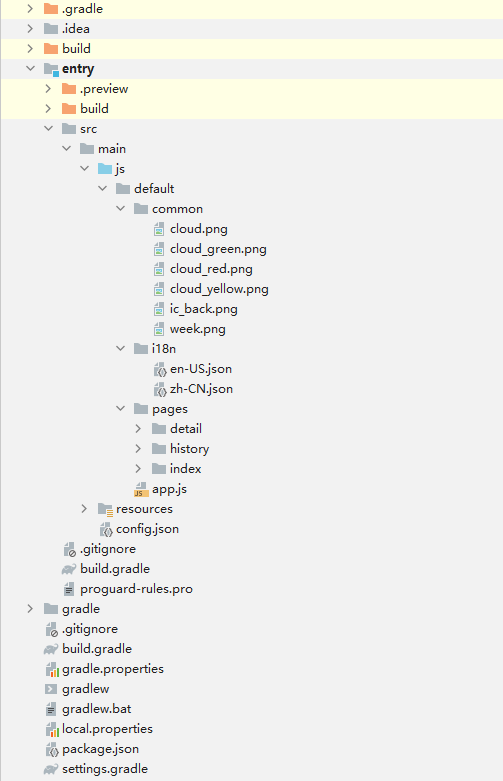
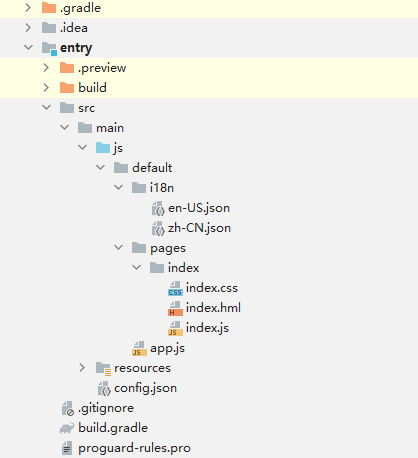
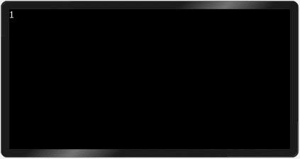
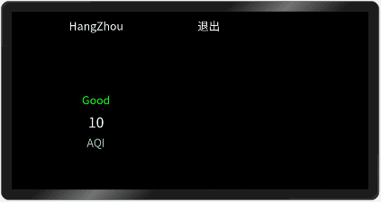
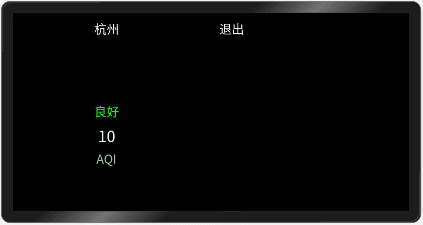
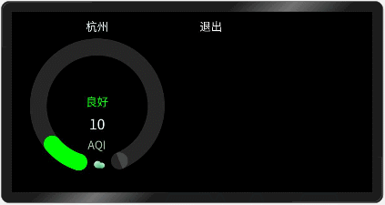
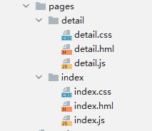
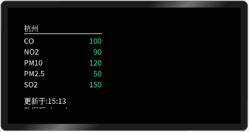
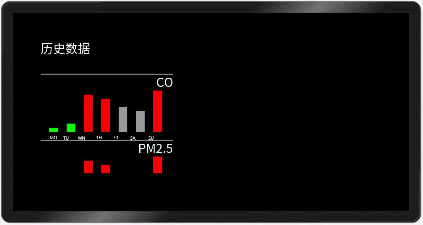

# 一、概述
**本篇我们将介绍L1开发板的Airquality案例，这是一个由鸿蒙JS开发模式所开发的北向应用案例。通过学习开发该案例，我们将会初步了解鸿蒙JS开发的基本流程，语法以及控件的应用。**<br>

# 二、相关概念
__page：__ paga通常相当于一个完整的页面，也可是一个组件。创建page通常是在pages文件夹下，右键创建JS paga完成。一个paga固定的有三个文件，hml、css、js。<br>

__hml：__ hml是一种类似web开发使用的html近似的语言，它们拥有几乎一样的语言特性与语法，都是用过标签形式生成控件，同时鸿蒙的hml还支持数据绑定与vue开发模式近似，通过{{ 变量 }}的形式与js绑定数据源，几乎任何形式的属性值或文本都能通过这种形式进行绑定。<br>

__js：__ js文件中所写的是JavaScript代码，鸿蒙开发通常只在js文件中编写JavaScript代码，hml文件中不支持编写JavaScript代码，一个page中的js文件只对应该paga下的hml文件代码。<br>

__css：__ css与web开发使用的css样式文件一样，一个paga下的css文件只对应该paga下的hml文件代码。<br>

# 三、代码讲解
## 1.项目结构

<br>
这是我们的空气质量检测完整项目的项目结构示意图，src>main目录就是我们的主要工程目录，js目录是我们的代码目录，resources是项目的资源目录，通常存放项目图标等资源文件，config.json是我们的项目配置文件。<br>

js目录下的default目录是该项目默认创建的一个JS FA目录，一个完整的JS FA结构就如同整个该default目录一样，它拥有一个common目录、i18n目录、pagas目录。<br>
__common：__ 存放FA需要的公共资源，可以是图片、通用js，通用样式或组件等。<br>
__i18n：__ 存放国际化语言文本文件（项目需要的固定文本）。<br>
__pagas：__ 存放该FA中所需要的所有paga，在pages下可以新建JS paga，创建一个paga就是一个文件夹加该paga所需的所有文件。<br>
__app.js：__它是该FA的入口程序文件，其中可以对该FA的生命周期添加一些操作。

## 2.项目预览
<br>
我们将要完成的就是这样一个效果的案例，里面的数据都是静态的设置好的固定数据，主要展示的是滑动容器组件、进度条组件和页面之间的跳转。

## 3.编辑主页
在了解了我们的一个大概的项目结构之后，接下来我们来自己创建一个项目，创建项目流程参考hello world教程。这里我们创建好项目之后得到这样一个结构的项目。<br>
<br>
我们在default目录下创建一个common文件夹，右键default>New>Package创建文件夹，名字定义为common，这就是我们的公共资源文件夹，然后我们将准备好的图片文件放到这个文件夹中。<br>

紧接着我们来修改一下index中的代码。<br>
打开index.hml文件将原本的代码删除，然后我们添加以下代码：
```
<swiper class="container" index="{{ swiperPage }}" duration="500" onchange="swiperChange">
</swiper>
```
__swiper：__ 是我们的滑动容器，它可以有多个子组件在容器中滑动切换。<br>
**index：** 该属性表示当前展示的子组件的下标，通过设置index我们可以进行子组件的切换与定义初始页面。<br>
__duration：__ 该属性表示子组件切换的动画时长。<br>
**onchange：** 该事件为当前显示的组件索引变化时触发该事件。<br>
添加好滑动容器组件后，我们给它编辑一下样式，找到index.css删除原本代码，添加以下代码：<br>
```
.container {
    height: 600px;
    width: 600px;
}
```
表示我们的这个滑动容器高、宽600px。<br>
然后我们再在它的js文件中添加我们要绑定的index与onchange：<br>
```
export default {
    data: {
        swiperPage : 0
    },
    swiperChange(e){
        this.swiperPage = e.index;
    }
}
```
__data：__ 页面的数据模型，类型是对象或者函数，如果类型是函数，返回值必须是对象。属性名不能以$或_开头，不要使用保留字for, if, show, tid。<br>
swiperChange：页面中的函数，函数与函数间通过逗号隔开。<br>

然后我们给容器中添加相关的内容：<br>
```
<swiper class="container" index="{{ swiperPage }}" duration="500" onchange="swiperChange">
    <!--第一个容器-->
    <stack class="container">
       <text>1</text>
    </stack>
    <!--第二个容器-->
    <stack class="container">
       <text>2</text>
    </stack>
</swiper>
```
这里我们添加2个`stack：`堆叠容器，这样页面就可以滑动了，可以给2个stack中分别添加`<text>1</text> <text>2</text>`这两个文本组件，来在预览里确认页面是否可以滑动。<br>
<br>
接下来再在stack容器中添加文本内容：<br>
```
<swiper class="container" index="{{ swiperPage }}" duration="500" onchange="swiperChange">
  <stack class="container">
    <text class="back" onclick="back">退出</text>
    <text class="airquality" style="color:{{ textColor1 }};">{{ airData[0].airQuality }}</text>
    <text class="location-text">{{ airData[0].location }}</text>
    <text class="pm25-value">{{ airData[0].detailData }}</text>
    <text class="pm25-name">AQI</text>
  </stack>
  <stack class="container">
    <text class="back" onclick="back">退出</text>
    <text class="airquality" style="color:{{ textColor2 }};">{{ airData[1].airQuality }}</text>
    <text class="location-text">{{ airData[1].location }}</text>
    <text class="pm25-value">{{ airData[1].detailData }}</text>
    <text class="pm25-name">AQI</text>
  </stack>
</swiper>
```
目前分别添加退出按钮、空气质量描述、地区、PM2.5的值、PM2.5的名称AQI，然后给他们分别添加样式与数据绑定。注意这里部分样式也可以通过绑定的形式展现。<br>
样式：<br>
```
.back{
    top: 20px;
    left: 500px;
}
.airquality {
    top: 220px;
    text-align: center;
    width: 454px;
    height: 40px;
}
.location-text {
    text-align: center;
    color: #f0ffff;
    width: 454px;
    height: 50px;
    top: 20px;
}
.pm25-value {
    text-align: center;
    font-size: 38px;
    color: #f0ffff;
    width: 454px;
    height: 50px;
    top: 275px;
}
.pm25-name {
    text-align: center;
    color: #a2c4a2;
    width: 454px;
    height: 50px;
    top: 335px;
}
```
绑定：<br>
```
import app from '@system.app' //导入系统api
export default {
    data: {
        swiperPage : 0,
        textColor1: "#00ff00",
        textColor2: "#00ff00",
        airData: [
            {
                location: "HangZhou",
                airQuality: "Good",
                detailData: 10
            },
            {
                location: "ShangHai",
                airQuality: "Unhealth",
                detailData: 90
            }
        ]
    },
    swiperChange(e){
        this.swiperPage = e.index;
    },
    back(e){
        console.log('exit');
        app.terminate();
    }
}

```
js数据绑定的时候要注意一下，使用import关键字导入系统接口或自定义的外部接口。<br>
<br>
这时候我们界面上出现的文本都是英文的，因为我们目前定义的数据都是英文文本，这里我们通过国际化处理机制，将文本转换成定中文。<br>
首先找到i18n目录，里面有en-US.json、zh-CN.json两个文件，将这两个文件中原本的内容删掉，添加以下内容：<br>
en-US.json<br>
```
{
  "HangZhou": "HangZhou",
  "ShangHai": "ShangHai",
  "Good": "Good",
  "Unhealth": "Unhealth",
  "Normal": "Normal",
  "airQuality": "Air Quality",
  "History": "History",
  "Close": "Close",
  "updated": "Updated",
  "dataSourceName": "From",
  "sampledOn": "Sampled on",
  "monitoringStation": "Monitoring Station",
  "historicalData": "Historical Data",
  "Monday": "Mo",
  "Tuesday": "Tu",
  "Wednesday": "We",
  "Thursday": "Th",
  "Friday": "Fr",
  "Saturday": "Sa",
  "Sunday": "Su"
}
```
zh-CN.json<br>
```
{
  "HangZhou": "杭州",
  "ShangHai": "上海",
  "Good": "良好",
  "Unhealth": "差",
  "Normal": "一般",
  "airQuality": "空气质量监测",
  "History": "历史",
  "Close": "关闭",
  "updated": "更新于",
  "dataSourceName": "数据源",
  "sampledOn": "采样时间",
  "historicalData": "历史数据",
  "Monday": "周一",
  "Tuesday": "周二",
  "Wednesday": "周三",
  "Thursday": "周四",
  "Friday": "周五",
  "Saturday": "周六",
  "Sunday": "周日"
}
```
这样我们的国际化文本就完成了，但是仅这样界面上的文本内容还是原来的英文，因为我们还需要将原本绑定的数据进行替换，我们需要在data模块下添加一个`onInit()`生命周期函数，这个函数是页面的初始化函数，在页面进行初始化的时候会执行。<br>
```
    onInit(){
        this.airData[0].location = this.$t(this.airData[0].location);
        this.airData[1].location = this.$t(this.airData[1].location);
        this.airData[0].airQuality = this.$t(this.airData[0].airQuality);
        this.airData[1].airQuality = this.$t(this.airData[1].airQuality);
    },
```
在初始化函数中添加了这段代码之后页面的上的文本内容就变成中文了，$t表示引用国际化json文件的内容。<br>
<br>
接下来我们来添加进度条组件与图片组件来完成我们页面的最终布局。<br>
```
<swiper class="container" index="{{ swiperPage }}" duration="500" onchange="swiperChange">
    <stack class="container">
        <text class="back" onclick="back">退出</text>
        <text class="airquality" style="color:{{ textColor1 }};">{{ airData[0].airQuality }}</text>
        <text class="location-text">{{ airData[0].location }}</text>
        <text class="pm25-value">{{ airData[0].detailData }}</text>
        <text class="pm25-name">AQI</text>
        <progress
                class="circleProgress"
                style="color:{{ textColor1 }};background-Color:{{ bgColor1 }};"
                type="arc"
                onclick="openDetail"
                percent="{{ percent1 }}"
                ></progress>
        <image class="image" src="{{ src1 }}"></image>
    </stack>
    <stack class="container">
        <text class="back" onclick="back">退出</text>
        <text class="airquality" style="color:{{ textColor2 }};">{{ airData[1].airQuality }}</text>
        <text class="location-text">{{ airData[1].location }}</text>
        <text class="pm25-value">{{ airData[1].detailData }}</text>
        <text class="pm25-name">AQI</text>
        <progress
                class="circleProgress"
                style="color: {{ textColor2 }};background-Color:{{ bgColor2 }};"
                type="arc"
                onclick="openDetail"
                percent="{{ percent2 }}"
                ></progress>
        <image class="image" src="{{ src2 }}"></image>
    </stack>
</swiper>
```
将progress与image依次添加到两个容器中，然后设置css样式与绑定的数据。<br>
css：
```
.circleProgress {
  center-x: 227px;
  center-y: 250px;
  radius: 180px;
  start-angle: 198;
  total-angle: 320;
  stroke-width: 45px;
  width: 454px;
  height: 454px;
}
.image {
  top: 390px;
  left: 217px;
  width: 32px;
  height: 32px;
}
```
js：<br>
首先在`onInit()`函数中继续添加如下代码<br>
```
    if (this.airData[0].detailData > 100) {
      this.src1 = "common/cloud_red.png";
      this.textColor1 = "#ff0000";
      this.bgColor1 = "#9d7462";
    } else if (50 < this.airData[0].detailData && this.airData[0].detailData <= 100) {
      this.src1 = "common/cloud_yellow.png";
      this.textColor1 = "#ecf19a";
      this.bgColor1 = "#9d9d62";
    }
    if (this.airData[1].detailData > 100) {
      this.src2 = "common/cloud_red.png";
      this.textColor2 = "#ff0000";
      this.bgColor2 = "#9d7462";
    } else if (50 < this.airData[1].detailData && this.airData[1].detailData <= 100) {
      this.src2 = "common/cloud_yellow.png";
      this.textColor2 = "#ecf19a";
      this.bgColor2 = "#9d9d62";
    }
    if (this.selectedCityIndex) {
      this.swiperPage = this.selectedCityIndex;
    }
```
这段意思是给不同程度的空气污染值设置不同的颜色和图片。<br>
接着在`onInit()`下添加一个`onShow()`函数，这个函数是生命周期函数中的显示页面函数，该函数在现实页面时执行。然后在onShow中添加以下代码：<br>
```
  onShow() {
    var self = this;
    var time = 1000 / self.airData[self.swiperPage].detailData;
    if (time == 0) {
      time = 100;
    }
    var interval = setInterval(function () {
      if ((self.swiperPage == 0 ? self.percent1 : self.percent2) >= self.airData[self.swiperPage].detailData) {
        clearInterval(interval);
        return;
      }
      self.swiperPage == 0 ? self.percent1++ : self.percent2++;
    }, time);
  },
```
这段代码通过一些简单的计算与`setInterval()`系统函数，对进度条组件的进度条根据所设定的值进行动态加载。<br>
然后再将这段代码复制一下，添加到我们之前定义的`swiperChange()`滑动事件函数中。<br>
```
  swiperChange(e) {
    this.swiperPage = e.index;
    var self = this;
    var time = 1000 / self.airData[self.swiperPage].detailData;
    if (time == 0) {
      time = 100;
    }
    var interval = setInterval(function () {
      if ((self.swiperPage == 0 ? self.percent1 : self.percent2) >= self.airData[self.swiperPage].detailData) {
        clearInterval(interval);
        return;
      }
      self.swiperPage == 0 ? self.percent1++ : self.percent2++;
    }, time);
  },
```
这样我们在滑动页面的时候也会动态加载进度条。<br>
<br>
到这步为止，我们的主页面就创建完成了，接下来我们来创建其他页面。<br>

## 4.创建并编辑detail页面
右键点击pages > New > JS page，输入名称detail，这样一个detail页面就创建完成了。<br>
<br>
然后我们进入detail.hml，将里面的代码删除，添加以下这段页面代码。<br>
```
<list style="top: 67px; left: 67px; width: 321px; height: 350px">
    <list-item style="width: 321px; height: 300px">
        <div
                style="width: 321px; height: 300px; background-color: #000000; flex-direction: column; align-items: flex-start"
                >
            <text style="width: 321px; height: 40px; color: #dcdcdc">{{ location }}</text>
            <div class="line-div"></div>
            <div class="info-div-width-height" style="margin-top: 10px">
                <text class="gas-name">CO</text>
                <text class="gas-value">{{ airData[0] }}</text>
            </div>
            <div class="info-div-width-height" style="margin-top: 10px">
                <text class="gas-name">NO2</text>
                <text class="gas-value">{{ airData[1] }}</text>
            </div>
            <div class="info-div-width-height" style="margin-top: 10px">
                <text class="gas-name">PM10</text>
                <text class="gas-value">{{ airData[2] }}</text>
            </div>
            <div class="info-div-width-height" style="margin-top: 10px">
                <text class="gas-name">PM2.5</text>
                <text class="gas-value">{{ airData[3] }}</text>
            </div>
            <div class="info-div-width-height" style="margin-top: 10px">
                <text class="gas-name">SO2</text>
                <text class="gas-value">{{ airData[4] }}</text>
            </div>
        </div>
    </list-item>
    <list-item style="width: 321px; height: 220px">
        <div
                style="width: 321px; height: 220px; background-color: #000000; flex-direction: column; align-items: flex-start"
                >
            <text class="config-info">{{ updated }}:{{ updateStatus }}</text>
            <text class="config-info">{{ dataSourceName }}:{{ dataSource }}</text>
            <div class="line-div"></div>
            <div style="width: 321px; height: 55px; align-items: center; margin-top: 20px">
                <input
                        type="button"
                        value="History"
                        style="border-width: 3px; margin-left: 10px; border-color: #90ee90; width: 146px; height: 50px"
                        onclick="openHistory"
                        />
                <input
                        type="button"
                        value="Close"
                        style="border-width: 3px; margin-left: 5px; border-color: #ff0000; width: 146px; height: 50px"
                        onclick="backMain"
                        />
            </div>
        </div>
    </list-item>
</list>
```
这是由一个list容器为主体的页面布局，其中两个list-item是它的内容，分别对应空气质量详细信息展示与跳转控制区域。<br>
再打开detail.css，把样式添加一下<br>
```
.line-div {
    background-color: #f5fffa;
    height: 2px;
    width: 454px;
}
.info-div-width-height {
    width: 321px;
    height: 35px;
    margin-top: 20px;
}
.gas-name {
    color: #f5fffa;
    width: 160px;
    height: 35px;
}
.gas-value {
    text-align: right;
    color: #00fa9a;
    width: 160px;
    height: 35px;
}
.config-info {
    height: 40px;
    width: 321px;
    color: #f5fffa;
}
```
然后打开detail.js，设置绑定数据。<br>
```
export default {
    data: {
        location: "HangZhou",
        updateStatus: "15:13",
        dataSource: "tianqi.com",
        updated: "Updated",
        dataSourceName: "Data Source",
        selectedIndex: 0,
        airData: ["100", "90", "120", "50", "150", "40", "25"]
    },
    onInit() {
        this.location = this.$t(this.location);
        this.updated = this.$t("updated");
        this.dataSourceName = this.$t("dataSourceName");
        this.sampledOn = this.$t("sampledOn");
        this.monitoringStation = this.$t("monitoringStation");
        this.selectedIndex = this.selectedCityIndex;
    }
}
```
这样我们的一个detail页面就设计完成了。
<br>

## 5.创建并编辑history页面
接下来我们用同样的方法快速创建下history页面。<br>
创建完成后，我们分别在hml、css、js文件中添加以下代码。<br>
hml:<br>
```
<list style="width: 321px; height: 321px; top: 67px; left: 67px">
    <list-item class="info-list-item">
        <div style="width: 321px; height: 80px; flex-direction: column; align-items: flex-start">
            <text class="div-info-historical-data">{{ historicalData }}</text>
        </div>
    </list-item>
    <list-item style="width: 321px; height: 160px" for="{{ datasets }}">
        <div style="width: 321px; height: 160px; flex-direction: column">
            <div style="width: 321px; height: 2px; background-color: #f5fffa"></div>
            <text class="gas-name">{{ $item }}</text>
            <div style="width: 321px; height: 100px; margin-top: 4px; justify-content: flex-start; align-items: flex-end">
                <div style="width: 21px; margin-left: 21px; height: 10px; background-color: #00ff00"></div>
                <div style="width: 21px; margin-left: 21px; height: 20px; background-color: #00ff00"></div>
                <div style="width: 21px; margin-left: 21px; height: 90px; background-color: #ff0000"></div>
                <div style="width: 21px; margin-left: 21px; height: 80px; background-color: #ff0000"></div>
                <div style="width: 21px; margin-left: 21px; height: 60px; background-color: #999999"></div>
                <div style="width: 21px; margin-left: 21px; height: 50px; background-color: #999999"></div>
                <div style="width: 21px; margin-left: 21px; height: 100px; background-color: #ff0000"></div>
            </div>
            <image style="width: 321px; height: 20px" src="common/week.png"></image>
        </div>
    </list-item>
    <list-item class="info-list-item">
        <input
                type="button"
                value="Back"
                style="border-width: 2px; border-color: #90ee90; width: 256px; height: 60px; margin-left: 30px; margin-top: 10px"
                onclick="backDetail"
                />
    </list-item>
</list>
```
css:<br>
```
.div-info-location {
    color: #dcdcdc;
    width: 321px;
    height: 40px;
}
.div-info-historical-data {
    color: #f5fffa;
    width: 321px;
    height: 40px;
}
.gas-name {
    color: #f0ffff;
    text-align: right;
    width: 321px;
    height: 35px;
}
.info-list-item {
    width: 321px;
    height: 80px;
}
```
js:<br>
```
export default {
    data: {
        historicalData: "historicalData",
        datasets: ["CO", "PM2.5", "NO2", "NO", "PM10", "SO2"]
    },
    onInit() {
        this.historicalData = this.$t(this.historicalData);
    }
}
```
这样一个history页面就完成了。<br>
<br>
注意一下，该页面的柱状图并不是用的图表控件chart，而是用div布局拼凑而成，通过给list-item设置for属性实现多段list-item自动生成。<br>
完成了这三个页面之后，接下来我们要将它们串联起来实现页面直接跳转。<br>

## 6.实现页面跳转
这里我们使用系统提供的router接口，来完成页面直接互相跳转。<br>
首先打开index.js，在里面加上跳转函数。<br>
`import router from "@system.router";`<br>
导入系统接口后添加：<br>
```
  openDetail() {
    router.replace({
      uri: "pages/detail/detail",
      params: { selectedCityIndex: this.swiperPage }
    });
  }
```
这个函数中调用了系统接口`router.replace()`来实现页面的跳转，其中传的参数是一个object类型参数，这个object中又有2个对象，uri与params。<br>
uri：路由目标地址。<br>
params：需要传递的参数对象。<br>

接着打开detail.js，在里面添加上跳转函数。<br>
```
  openHistory() {
    router.replace({
      uri: "pages/history/history"
    });
  },
  backMain() {
    router.replace({
      uri: "pages/index/index",
      params: { selectedCityIndex: this.selectedIndex }
    });
  }
```

最后是history.js<br>
```
  backDetail() {
    router.replace({
      uri: "pages/detail/detail"
    });
  }
```
这样我们的页面之间跳转就实现了。<br>
<br>
到这步为止我们的Airquality案例就算是开发完成了。<br>

# 四、总结
>鸿蒙JS开发模式创建项目与创建paga都非常的简单快捷。<br>
JS开发模式的数据绑定机制使界面开发变的更加灵活且简单。<br>


# 五、完整示例
