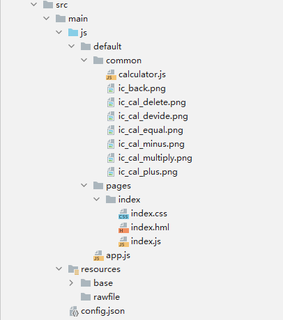
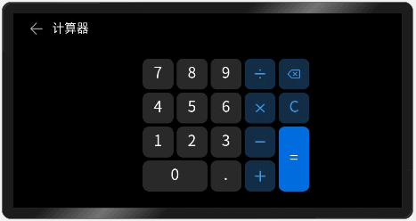
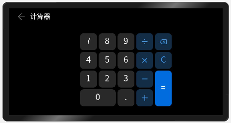

# 一、概述
__本篇我们将介绍L1开发板的Calculator案例，这是一个由鸿蒙JS开发模式所开发的北向应用案例。该案例是一个简易计算器案例，通过该案例我们将了解到hml的组合样式与JS的引用外部函数的方法。__<br>

# 二、相关概念
JavaScript数组对象：数组对象是使用单独的变量名来存储一系列的值，JavaScript的数组相对来说较为灵活，通过[]方式声明或者`var array = new Array();`，没有特定的数组类型，里面可以存放任意类型的数据。<br>

 __import：__ JavaScript导入关键字，用于导入由另一个模块中的对象或函数。<br>

__export：__ 用于从模块中导出实时绑定的函数、对象或原始值，以便其他程序可以通过 `import` 语句使用它们。被导出的绑定值依然可以在本地进行修改。在使用 `import` 进行导入时，这些绑定值只能被导入模块所读取，但在 `export` 导出模块中对这些绑定值进行修改，所修改的值也会实时地更新。<br>

# 三、代码讲解
## 1.项目结构
<br>
这是我们计算器项目的项目结构示意图，计算器只有一个页面，还需要一些图片作为资源。<br>

## 2.项目预览
<br>
我们将要完成的就是这样一个效果的案例，它可以完成简单的数学计算。<br>

## 3.编辑主页
首先创建工程，在default下新建一个common（公共资源文件夹），将我们的图片资源导入进去。<br>
我们通过组合样式的形式来使界面元素按照规则排列，首先我们先在index.hml中添加以下代码：<br>
```
<stack class="calc-container" @swipe="handleTerminate">
    <stack class="calc-titlebar" @click="handleExist">
        <image class="calc-icon calc-back-btn" src="/common/ic_back.png" />
        <text class="calc-title">
            计算器
        </text>
    </stack>

    <text class="calc-expr">
        {{expression}}
    </text>
    <text class="calc-rsl">
        {{result}}
    </text>
    <input class="calc-text-btn calc-btn-row-1 calc-btn-col-1" type="button" value="7" @click="handleInput('7')" />
    <input class="calc-text-btn calc-btn-row-1 calc-btn-col-2" type="button" value="8" @click="handleInput('8')" />
    <input class="calc-text-btn calc-btn-row-1 calc-btn-col-3" type="button" value="9" @click="handleInput('9')" />
    <input class="calc-op-btn calc-btn-row-1 calc-btn-col-4" type="button" value="" @click="handleInput('/')" />
    <input class="calc-op-btn calc-btn-row-1 calc-btn-col-5" type="button" value="" @click="handleBackspace()" />
    <input class="calc-text-btn calc-btn-row-2 calc-btn-col-1" type="button" value="4" @click="handleInput('4')" />
    <input class="calc-text-btn calc-btn-row-2 calc-btn-col-2" type="button" value="5" @click="handleInput('5')" />
    <input class="calc-text-btn calc-btn-row-2 calc-btn-col-3" type="button" value="6" @click="handleInput('6')" />
    <input class="calc-op-btn calc-btn-row-2 calc-btn-col-4" type="button" value="" @click="handleInput('*')" />
    <input class="calc-op-btn calc-btn-row-2 calc-btn-col-5" type="button" value="C" @click="handleClear" />
    <input class="calc-text-btn calc-btn-row-3 calc-btn-col-1" type="button" value="1" @click="handleInput('1')" />
    <input class="calc-text-btn calc-btn-row-3 calc-btn-col-2" type="button" value="2" @click="handleInput('2')" />
    <input class="calc-text-btn calc-btn-row-3 calc-btn-col-3" type="button" value="3" @click="handleInput('3')" />
    <input class="calc-op-btn calc-btn-row-3 calc-btn-col-4" type="button" value="" @click="handleInput('-')" />
    <input class="calc-equals-btn calc-btn-row-3 calc-btn-col-5 calc-btn-col-span-2" type="button" value="=" @click="handleEqual" />
    <input class="calc-text-btn calc-btn-row-4 calc-btn-col-1 calc-btn-row-span-2" type="button" value="0" @click="handleInput('0')" />
    <input class="calc-text-btn calc-btn-row-4 calc-btn-col-3" type="button" value="." @click="handleInput('.')" />
    <input class="calc-op-btn calc-btn-row-4 calc-btn-col-4" type="button" value="" @click="handleInput('+')" />
    <image class="calc-icon calc-icon-row-1 calc-icon-col-1" src="/common/ic_cal_devide.png"></image>
    <image class="calc-icon calc-icon-row-1 calc-icon-col-2" src="/common/ic_cal_delete.png"></image>
    <image class="calc-icon calc-icon-row-2 calc-icon-col-1" src="/common/ic_cal_multiply.png"></image>
    <image class="calc-icon calc-icon-row-3 calc-icon-col-1" src="/common/ic_cal_minus.png"></image>
    <image class="calc-icon calc-icon-row-4 calc-icon-col-1" src="/common/ic_cal_plus.png"></image>
</stack>
```
左边通过多个input组合形成计算器的按钮，右边使用text显示数字与结果。虽然我们写好了页面代码但是他们还没有样式，接下来我们来添加样式。大家可以看到我们每个input与image中class绑定了多个样式比如`<image class="calc-icon calc-icon-row-4 calc-icon-col-1" src="/common/ic_cal_plus.png"></image>`，这种写法表示该图片组件同时拥有`calc-icon`、`calc-icon-row-4`、`calc-icon-col-1`三种样式，多样式组合之间需要用空格隔开。<br>
接下来在index.css中天添加以下代码：<br>
```
.calc-container {
    height: 480px;
    width: 800px;
}
.calc-icon {
    width: 36px;
    height: 36px;
}
.calc-titlebar {
    margin-top: 10px;
    width: 200px;
    height: 60px;
}
.calc-back-btn {
    left: 39px;
    top: 10px;
}
.calc-title {
    left: 96px;
    font-size: 30px;
    top: 2px;
}
.calc-expr, .calc-rsl {
    left: 68px;
    width: 200px;
}
.calc-expr {
    font-size: 72px;
    top: 100px;

}
.calc-rsl {
    color: #999;
    font-size: 38px;
    top: 374px;
}
.calc-text-btn, .calc-op-btn, .calc-equals-btn {
    border-radius: 16px;
    height: 76px;
    width: 76px;
    font-size: 38px;
}
.calc-text-btn {
    background-color: rgb(41, 41, 41);
}
.calc-text-btn:active {
    background-color: rgb(72, 72, 72);
}
.calc-op-btn {
    background-color: #4D3F97E9;
    color: #FF3F97E9;
}
.calc-op-btn:active {
    background-color: rgb(54, 76, 97);
}
.calc-equals-btn {
    background-color: #FF006CDE;
    color: #fff;
}
.calc-equals-btn:active {
    background-color: rgb(38, 129, 226);
}
.calc-btn-row-1 {
    top: 112px;
}
.calc-btn-row-2 {
    top: 196px;
}
.calc-btn-row-3 {
    top: 280px;
}
.calc-btn-row-4 {
    top: 364px;
}
.calc-btn-col-1 {
    left: 320px;
}
.calc-btn-col-2 {
    left: 404px;
}
.calc-btn-col-3 {
    left: 488px;
}
.calc-btn-col-4 {
    left: 572px;
}
.calc-btn-col-5 {
    left: 656px;
}
.calc-btn-row-span-2 {
    width: 160px;
}
.calc-btn-col-span-2 {
    height: 160px;
}
.calc-icon-row-1 {
    top: 132px;
}
.calc-icon-row-2 {
    top: 216px;
}
.calc-icon-row-3 {
    top: 300px;
}
.calc-icon-row-4 {
    top: 384px;
}
.calc-icon-col-1 {
    left: 592px;
}
.calc-icon-col-2 {
    left: 676px;
}
```
这些样式可以理解为网格样式，它们规定了元素的具体位置比如该元素应处于哪一行，因处于哪一列，但是我们的hml中是没有写网格布局的，所以css通过绝对定位的形式，写出了网格样式，当你的控件使用了其中一个表示某行或某列的样式后，就能在无网格组件的情况下确定你的组件的位置。<br>

当我们完成这些，计算器的基本外形就已经完成了。<br>
<br>

## 4.编写计算函数
接下来要编写计算函数，首先我们先在common下创建一个计算的公共js文件，calculator.js，在calculator.js中编写计算函数：<br>
```
const OperatorLevels = {
    "+": 0,
    "-": 0,
    "*": 1,
    "/": 1,
};

const OperatorHandlers = {
    "+": (one, other) => one + other,
    "-": (one, other) => one - other,
    "*": (one, other) => one * other,
    "/": (one, other) => one / other,
};

function calcSuffixExpression(expression) {
    const numberStack = [];

    while (expression.length) {
        const element = expression.shift();
        if (!isOperator(element)) {
            numberStack.push(Number(element));
        } else {
            const one = numberStack.pop();
            const other = numberStack.pop();
            const result = OperatorHandlers[element](other, one);
            numberStack.push(result);
        }
    }
    return numberStack[0];
}

function toSuffixExpression(expression) {
    const operatorStack = [];
    const suffixExpression = [];
    let topOperator;
    for (let idx = 0, size = expression.length; idx < size; idx++) {
        const element = expression[idx];
        if (element === "(") {
            operatorStack.push(element);
            continue;
        }
        if (element === ")") {
            if (operatorStack.length) {
                let operator = operatorStack.pop();
                while (operator !== "(") {
                    suffixExpression.push(operator);
                    operator = operatorStack.pop();
                }
            }
            continue;
        }
        if (isOperator(element)) {
            if (!operatorStack.length) {
                operatorStack.push(element);
            } else {
                topOperator = operatorStack[operatorStack.length - 1];
                if (!isGrouping(topOperator) && !isPrioritized(element, topOperator)) {
                    suffixExpression.push(operatorStack.pop());
                }
                operatorStack.push(element);
            }
            continue;
        }
        suffixExpression.push(element);
    }
    while (operatorStack.length) {
        suffixExpression.push(operatorStack.pop());
    }
    return suffixExpression;
}

function parseInfixExpression(content) {
    const size = content.length;
    const lastIdx = size - 1;
    let number = "";
    const expression = [];
    for (let idx = 0; idx < size; idx++) {
        const element = content[idx];
        if (isGrouping(element)) {
            if (number !== "") {
                expression.push(number);
                number = "";
            }
            expression.push(element);
        } else if (isOperator(element)) {
            if (isSymbol(element) && (idx === 0 || content[idx - 1] === "(")) {
                number += element;
            } else {
                if (number !== "") {
                    expression.push(number);
                    number = "";
                }

                if (idx !== lastIdx) {
                    expression.push(element);
                }
            }
        } else {
            number += element;
        }

        if (idx === lastIdx && number !== "") {
            expression.push(number);
        }
    }
    return expression;
}

function isPrioritized(one, other) {
    return OperatorLevels[one] > OperatorLevels[other];
}
//判断输入符号
export function isOperator(operator) {
    return (
        operator === "+" || operator === "-" || operator === "*" || operator === "/"
    );
}

function isSymbol(symbol) {
    return symbol === "+" || symbol === "-";
}

function isGrouping(operator) {
    return operator === "(" || operator === ")";
}
//计算
export function calc(content) {
    const infixExpression = parseInfixExpression(content);
    const suffixExpression = toSuffixExpression(infixExpression);
    return calcSuffixExpression(suffixExpression);
}
```
该部分代码是写在公共区域的JS代码，负责完成界面的上的输入后的显示处理以及计算处理，通过export声明方式被index用import调用。<br>
接下来再在index.js中添加以下代码：<br>
```
import {calc, isOperator} from '../../common/calculator.js';
import app from '@system.app';

let pressedEqual = false;

export default {
    data: {
        expression: '',
        result: ''
    },
    onInit() {
        this.$watch(() => this.expression, (value)=> {
            if (value !== '') {
                this.result = calc(value).toString();
            }
        });
    },
    handleClear() {
        this.expression = '';
        this.result = '';
    },
    handleInput(value) {
        if (isOperator(value)) {
            if (pressedEqual) {
                pressedEqual = false;
            } else {
                const size = this.expression.length;
                if (size) {
                    const last = this.expression.charAt(size - 1);
                    if (isOperator(last)) {
                        this.expression = this.expression.slice(0, -1);
                    }
                }
            }
            if (!this.expression && (value == '*' || value == '/')) {
                return;
            }
            this.expression += value;
        } else {
            if (pressedEqual) {
                this.expression = value;
                pressedEqual = false;
            } else {
                this.expression += value;
            }
        }
    },
    handleBackspace() {
        if(pressedEqual) {
            this.expression = '';
            this.result = '';
            pressedEqual = false;
        } else {
            this.expression = this.expression.slice(0, -1);
            if (!this.expression.length) {
                this.result = '';
            }
        }
    },
    handleEqual() {
        if (this.result !== '') {
            this.expression = this.result;
            this.result = '';
            pressedEqual = true;
        }
    },
    handleTerminate(e) {
        if (e.direction === 'right') {
            app.terminate();
        }
    },
    handleExist() {
        app.terminate();
    },
}
```
通过import导入calculator.js中的函数之后，使用其中的`calc`函数进行计算，`isOperator`函数进行运算符判断。通过`this.$watch`绑定页面的监听事件。<br>
这样我们的计算器程序就完成了。<br>

# 四、总结
>开发计算器需要熟悉js的基本运算符，了解import与export关键字。<br>
样式组合是通过给class绑定多个样式名称实现的，样式之间通过空格分隔。<br>

# 五、完整示例
