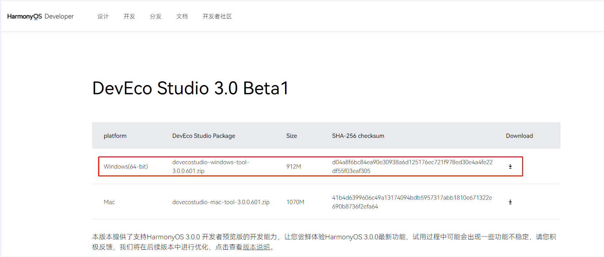
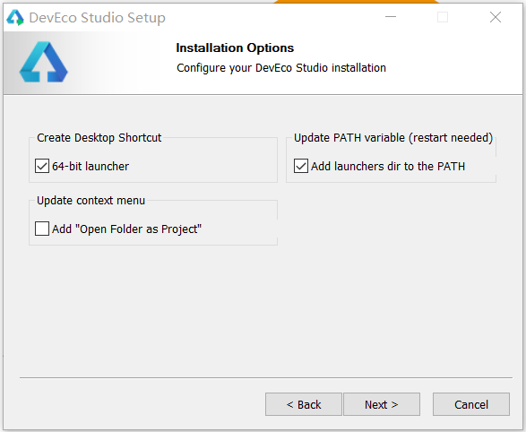
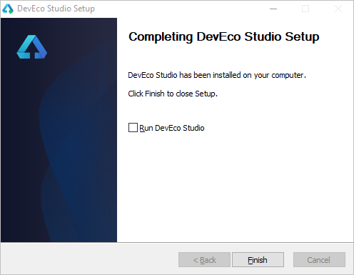
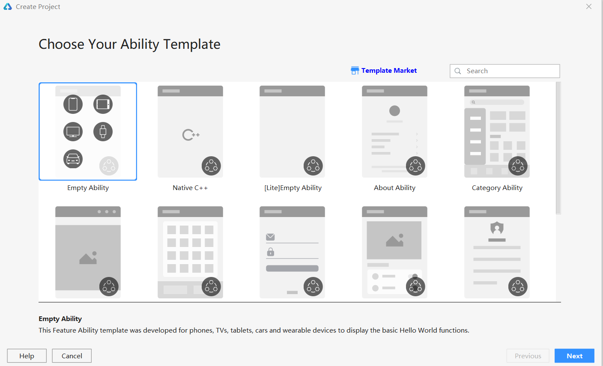
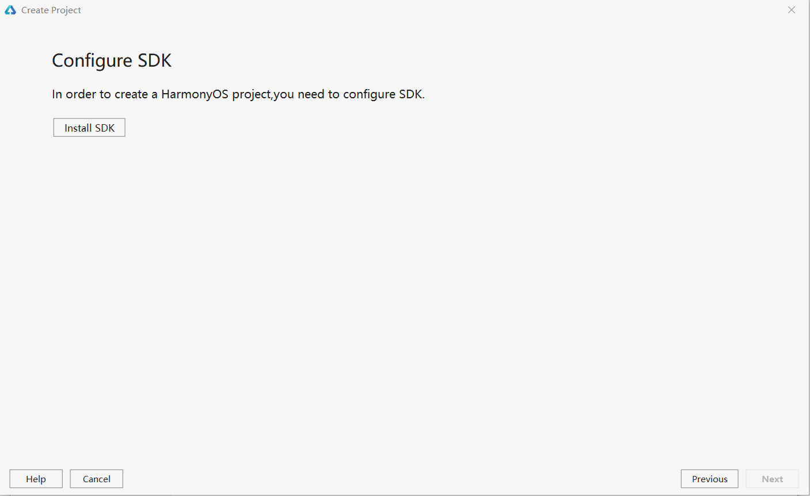

# 一、下载DevEco Studio开发工具包
1.直接进入`https://developer.harmonyos.com/cn/develop/deveco-studio#download`产品下载页选择需要的产品进行下载，这里我们选择最新3.0版本的Windows平台版。 

# 二、安装DevEco Studio开发工具包
1.找到刚刚下载的压缩包，解压直接双击里面的deveco-studio-xxxx.exe程序，进入DevEco Studio安装向导，在如下安装选项界面勾选64-bit launcher后（Add launchers dir to the PATH可以不勾选），点击Next，直至安装完成。 

 

2.安装完成后，点击Finish完成安装。 

 

# 三、安装HarmonyOS开发插件
1.安装完成后创建一个empty ability项目，如未安装SDK系统会提示安装相应的SDK插件。 
 

2.点击Install SDK根据提示安装相应的SDK即可 

 